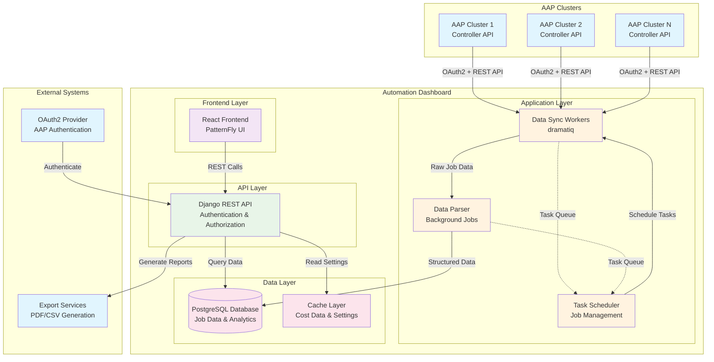
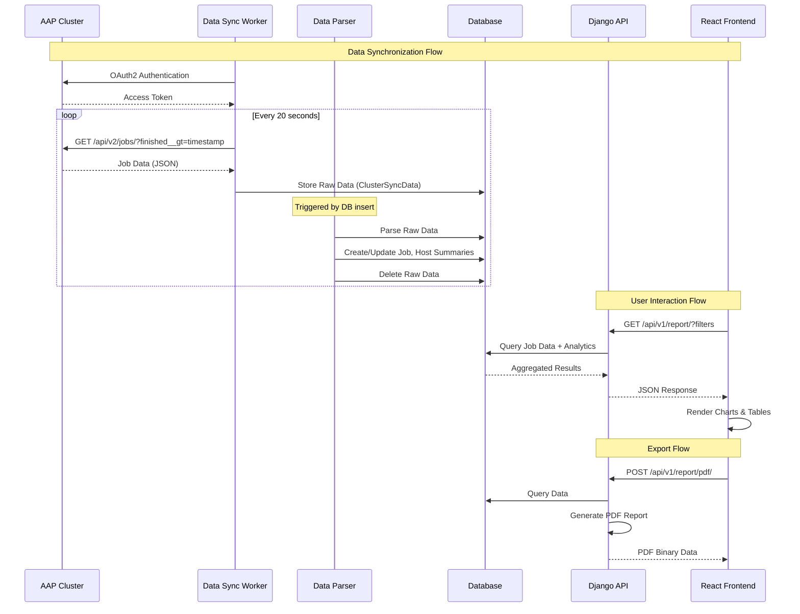

# System Architecture Overview

The Automation Dashboard is a comprehensive reporting and analytics platform for Ansible Automation Platform (AAP) deployments. It provides insights into automation performance, cost analysis, and operational metrics.

## High-Level System Architecture

## Core Components

### 1. Frontend Layer (React Application)
- **Technology**: React 18 + TypeScript + PatternFly
- **Purpose**: Interactive dashboards, filtering, and report visualization
- **Key Features**:
  - Real-time analytics dashboards
  - Advanced filtering and date range selection
  - Cost analysis and savings calculations
  - Export functionality (PDF/CSV)
  - Responsive design with PatternFly components

### 2. API Layer (Django REST Framework)
- **Technology**: Django 4.2 + Django REST Framework
- **Purpose**: RESTful API for data access and business logic
- **Key Features**:
  - OAuth2 authentication with AAP clusters
  - Comprehensive filtering and pagination
  - Report generation and analytics
  - Settings and configuration management
  - Role-based access control

### 3. Application Layer (Background Workers)
- **Technology**: dramatiq dispatcher system
- **Purpose**: Asynchronous data processing and synchronization
- **Components**:
  - **Data Sync Workers**: Fetch job data from AAP APIs
  - **Data Parser**: Transform and store job data
  - **Task Scheduler**: Manage background job execution

### 4. Data Layer (PostgreSQL)
- **Technology**: PostgreSQL with Django ORM
- **Purpose**: Persistent storage for all application data
- **Key Entities**:
  - Clusters (AAP installations)
  - Jobs (automation executions)
  - Organizations, Projects, Templates
  - Cost data and settings

## Data Flow Architecture

## Key Design Patterns

### 1. Separation of Concerns
- **Data Ingestion**: Background workers handle AAP data synchronization
- **Data Processing**: Separate parser transforms raw data into structured format
- **Data Presentation**: API layer provides clean interface for frontend
- **User Interface**: Frontend focuses purely on presentation and interaction

### 2. Asynchronous Processing
- Non-blocking data synchronization from multiple AAP clusters
- Background task queue prevents API blocking
- Real-time updates without impacting user experience

### 3. Microservice-Ready Architecture
- Clear component boundaries
- RESTful API design
- Stateless frontend application
- Containerized deployment

### 4. Security-First Design
- OAuth2 integration for cluster authentication
- Encrypted storage of access tokens
- Role-based access control
- Secure API endpoints

## Scalability Considerations

### Horizontal Scaling
- **Frontend**: Static assets can be CDN-cached
- **API**: Stateless Django application (multiple instances)
- **Workers**: Task queue supports multiple worker processes
- **Database**: PostgreSQL supports read replicas

### Performance Optimizations
- **Caching**: Cost data and settings cached in memory
- **Database Indexing**: Optimized queries for large datasets
- **Pagination**: API responses paginated for large result sets
- **Filtering**: Database-level filtering reduces data transfer

### Data Volume Handling
- **Incremental Sync**: Only fetch new/updated job data
- **Batch Processing**: Process multiple jobs in single transactions
- **Data Retention**: Configurable retention policies for historical data
- **Background Processing**: Heavy calculations performed asynchronously

## Technology Stack Summary

| Layer | Technology | Purpose |
|-------|------------|---------|
| Frontend | React 18 + TypeScript | User interface and interaction |
| UI Framework | PatternFly React | Consistent design system |
| State Management | Redux Toolkit | Frontend state management |
| API | Django 4.2 + DRF | RESTful API and business logic |
| Database | PostgreSQL | Data persistence and analytics |
| Background Jobs | dramatiq | Asynchronous task processing |
| Authentication | OAuth2 | Secure AAP integration |
| Deployment | Docker + Ansible | Containerized deployment |
| Web Server | nginx | Static files and reverse proxy |

## Next Steps

This overview provides the foundation for understanding the system. Continue with:
1. [Data Synchronization Architecture](02-data-sync-architecture.md) - Deep dive into AAP integration
2. [Analytics and Reporting Architecture](03-analytics-reporting.md) - Report generation details
3. [API Architecture](04-api-architecture.md) - REST API design and endpoints