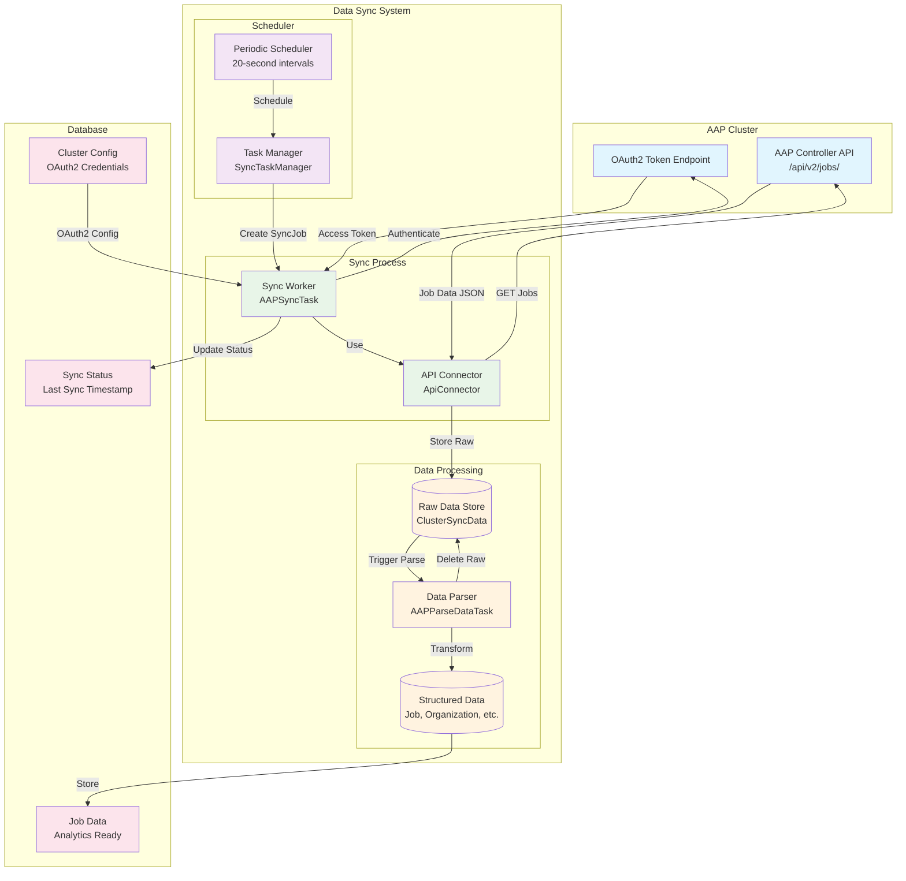
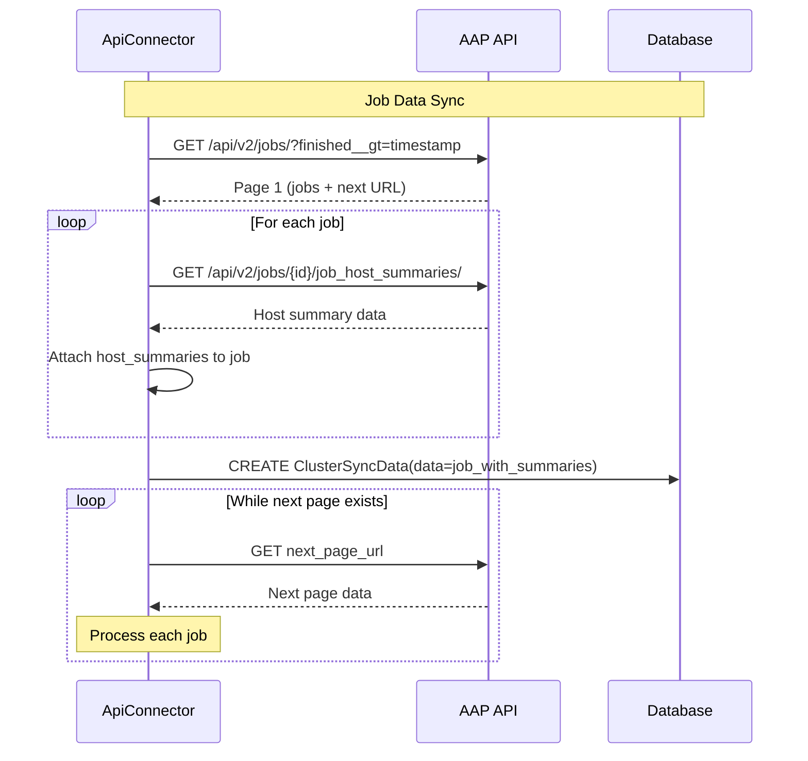
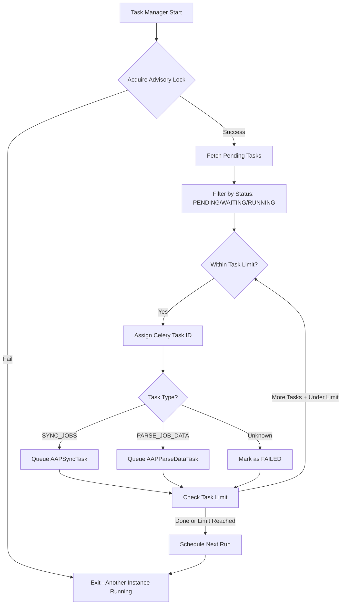
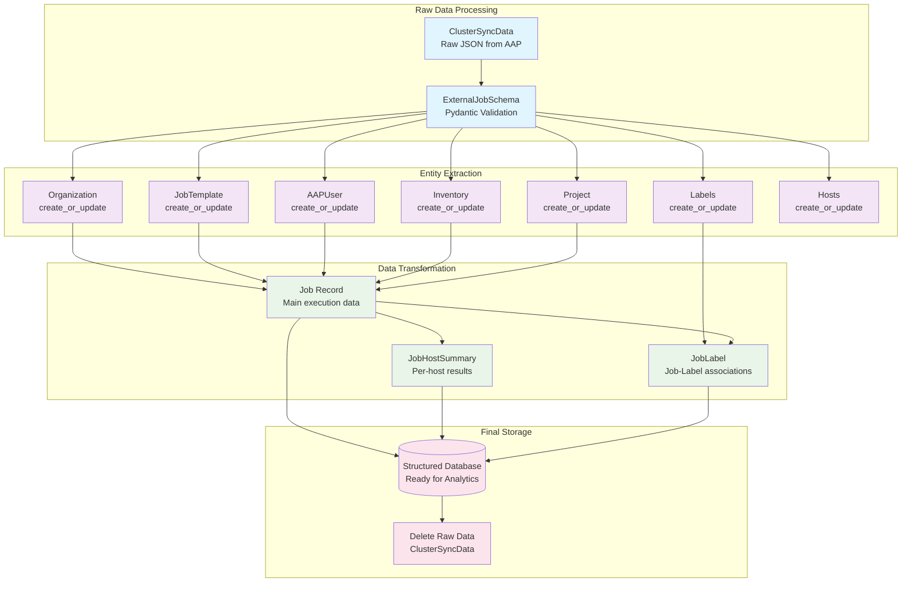

# Data Synchronization Architecture

The Automation Dashboard synchronizes job execution data from multiple AAP clusters through a sophisticated background processing system. This document details the data ingestion, transformation, and storage processes.

## Overview

The data synchronization system consists of three main components:
1. **ApiConnector**: Handles communication with AAP clusters
2. **Background Workers**: Manage asynchronous data processing
3. **DataParser**: Transforms raw AAP data into structured database records

## Data Sync Flow Architecture



## Component Details

### 1. API Connector (ApiConnector)

**Location**: `src/backend/apps/clusters/connector.py`

The ApiConnector class manages all communication with AAP cluster APIs:

```python
class ApiConnector:
    def __init__(self, cluster, timeout=30, since=None, until=None, managed=False):
        self.cluster = cluster
        self.access_token = decrypt_value(cluster.access_token)  # Encrypted storage
        # Date range for incremental sync
        self.since = since or last_sync_date
        self.until = until
```

**Key Features**:
- **OAuth2 Authentication**: Handles bearer token authentication
- **Version Detection**: Auto-detects AAP 2.4 vs 2.5 API differences
- **Incremental Sync**: Only fetches jobs since last successful sync
- **Pagination Handling**: Automatically follows API pagination
- **Error Handling**: Robust handling of network and API errors

**Data Fetching Process**:


### 2. Background Task System

**Technology**: dramatiq dispatcher system
**Configuration**: `django_config/settings.py` - DISPATCHER_SCHEDULE

The task system operates on multiple queues:
- **Sync Queue** (`automation_dashboard_sync_channel`): Handles data fetching
- **Parse Queue** (`automation_dashboard_parse_channel`): Handles data transformation

**Task Scheduling**:
```python
CELERYBEAT_SCHEDULE = {
    'sync_task_manager': {
        'task': 'backend.apps.scheduler.tasks.sync_task_manager',
        'schedule': timedelta(seconds=20),  # Every 20 seconds
        'options': {'expires': 20}
    }
}
```

### 3. Task Manager (SyncTaskManager)

**Location**: `src/backend/apps/scheduler/task_manager.py`

Manages the execution of sync and parse tasks:



**Key Features**:
- **Advisory Locking**: Prevents multiple task managers from running simultaneously
- **Task Limiting**: Prevents system overload with configurable task limits
- **Timeout Handling**: Graceful handling of long-running processes
- **Error Recovery**: Resets failed tasks for retry

### 4. Data Sync Worker (AAPSyncTask)

**Location**: `src/backend/apps/tasks/jobs.py`

Executes the actual data synchronization:

```python
@task(queue=settings.DISPATCHER_SYNC_CHANNEL)
def aap_sync_task(sync_job_id):
    sync_job = SyncJob.objects.get(pk=sync_job_id)
    try:
        sync_job.status = JobStatusChoices.RUNNING
        sync_job.started = timezone.now()
        sync_job.save()
        
        connector = ApiConnector(
            cluster=sync_job.cluster,
            since=sync_job.since,
            until=sync_job.until
        )
        
        connector.sync_jobs()  # Fetch and store job data
        
        sync_job.status = JobStatusChoices.SUCCESSFUL
        sync_job.finished = timezone.now()
    except Exception as e:
        sync_job.status = JobStatusChoices.FAILED
        sync_job.explanation = str(e)
    finally:
        sync_job.save()
```

### 5. Data Parser (DataParser)

**Location**: `src/backend/apps/clusters/parser.py`

Transforms raw AAP job data into structured database records:



**Data Transformation Process**:

1. **Schema Validation**: Raw JSON validated against Pydantic schemas
2. **Entity Resolution**: Referenced entities created/updated using `create_or_update` pattern
3. **Job Processing**: Main job record created with all relationships
4. **Host Summary Processing**: Individual host execution results stored
5. **Label Association**: Many-to-many relationships established
6. **Aggregation**: Host counts and statistics calculated
7. **Cleanup**: Raw data deleted after successful processing

### 6. Data Models and Relationships

**Key Models**:

```python
# Core Configuration
class Cluster(models.Model):
    protocol = CharField()           # https
    address = CharField()            # aap.company.com
    port = IntegerField()           # 443
    access_token = BinaryField()    # Encrypted OAuth2 token
    verify_ssl = BooleanField()     # SSL verification
    aap_version = CharField()       # AAP 2.4 or 2.5

# Temporary Storage
class ClusterSyncData(models.Model):
    cluster = ForeignKey(Cluster)
    data = JSONField()              # Raw AAP job data

# Parsed Entities
class Job(models.Model):
    cluster = ForeignKey(Cluster)
    external_id = IntegerField()    # AAP job ID
    name = CharField()
    status = CharField()            # successful/failed
    started = DateTimeField()
    finished = DateTimeField()
    elapsed = DecimalField()        # Runtime in seconds
    
    # Relationships
    organization = ForeignKey(Organization, null=True)
    job_template = ForeignKey(JobTemplate, null=True)
    project = ForeignKey(Project, null=True)
    inventory = ForeignKey(Inventory, null=True)
    launched_by = ForeignKey(AAPUser, null=True)
    
    # Host statistics
    num_hosts = IntegerField()
    changed_hosts_count = IntegerField()
    failed_hosts_count = IntegerField()
    # ... additional host counters
```

## Sync Configuration and Management

### Cluster Configuration

Clusters are configured via YAML file and managed through Django commands:

```yaml
# clusters.yaml
clusters:
  - name: "Production AAP"
    protocol: "https"
    address: "aap-prod.company.com"
    port: 443
    verify_ssl: true
    access_token: "oauth2_access_token"
    aap_version: "AAP 2.5"
```

**Management Commands**:
```bash
# Configure clusters from YAML
python manage.py setclusters clusters.yaml

# Manual data sync for date range
python manage.py syncdata --since=2025-01-01 --until=2025-01-31

# Clear all job data
python manage.py cleardb
```

### Sync Status Tracking

```python
class ClusterSyncStatus(models.Model):
    cluster = OneToOneField(Cluster)
    last_job_finished_date = DateTimeField()  # Track incremental sync
```

The system tracks the last successfully synced job's finish date to enable incremental synchronization, reducing API load and processing time.

## Error Handling and Recovery

### Sync Error Scenarios

1. **Network Failures**: Exponential backoff with retry logic
2. **Authentication Failures**: Token refresh handling
3. **API Changes**: Version detection and compatibility checks
4. **Data Corruption**: Schema validation prevents invalid data storage
5. **Parsing Failures**: Failed jobs marked for manual review

### Recovery Mechanisms

1. **Task Reset**: Failed tasks reset to PENDING for retry
2. **Incremental Recovery**: Resume from last successful timestamp
3. **Manual Override**: Management commands for data repair
4. **Monitoring**: Comprehensive logging for troubleshooting

## Performance Considerations

### Optimization Strategies

1. **Batch Processing**: Process multiple jobs in single transactions
2. **Parallel Workers**: Multiple worker processes handle concurrent clusters
3. **Database Indexes**: Optimized for common query patterns
4. **Rate Limiting**: Configurable request rates to prevent API overload
5. **Connection Pooling**: Reuse database connections across requests

### Scaling Guidelines

- **Small Deployments**: Single worker process per cluster
- **Medium Deployments**: 2-4 worker processes with load balancing
- **Large Deployments**: Dedicated worker nodes with queue partitioning

## Next Steps

Continue with:
1. [Analytics and Reporting Architecture](03-analytics-reporting.md) - How synced data becomes insights
2. [Database Schema](06-database-schema.md) - Detailed data model relationships