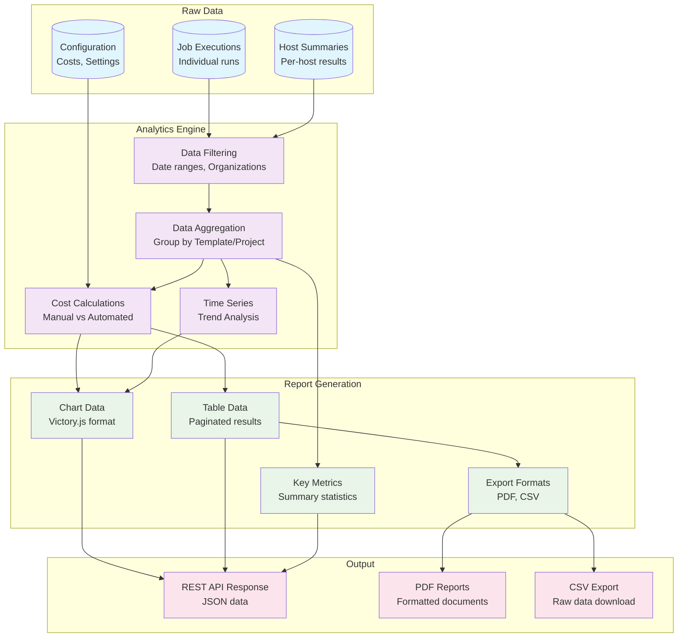
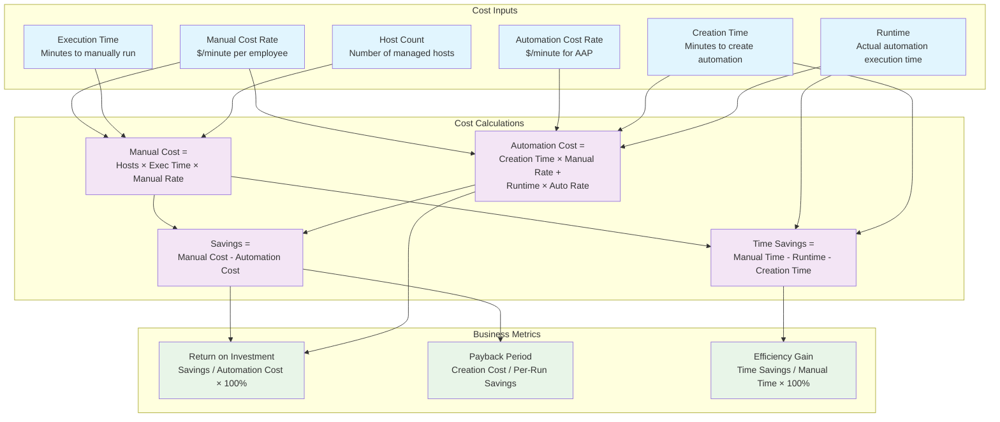

# Analytics and Reporting Architecture

The Automation Dashboard provides comprehensive analytics and reporting capabilities, transforming raw AAP job execution data into actionable business insights. This document details the analytics engine, cost calculations, and report generation systems.

## Overview

The analytics system processes synchronized job data to provide:
- **Cost Analysis**: Manual vs automated execution costs
- **Performance Metrics**: Execution times, success rates, host statistics
- **Trend Analysis**: Time-series data for performance tracking
- **Operational Insights**: User activity, project utilization, failure analysis

## Analytics Data Flow



## Core Analytics Components

### 1. Data Aggregation Engine

**Location**: `src/backend/api/v1/report/views.py:68-101`

The analytics engine aggregates job data by template, providing key metrics:

```python
def get_base_queryset(self) -> QuerySet[Job]:
    costs = Costs.get()
    automated_cost_value = costs[CostsChoices.AUTOMATED] / decimal.Decimal(60)
    manual_cost_value = costs[CostsChoices.MANUAL]

    qs = (
        Job.objects.successful_or_failed()
        .values(
            "name",
            "cluster", 
            "job_template_id",
            time_taken_manually_execute_minutes=F("job_template__time_taken_manually_execute_minutes"),
            time_taken_create_automation_minutes=F("job_template__time_taken_create_automation_minutes"),
        ).annotate(
            runs=Count("id"),
            successful_runs=Count("id", filter=Q(status=JobStatusChoices.SUCCESSFUL)),
            failed_runs=Count("id", filter=Q(status=JobStatusChoices.FAILED)),
            elapsed=Sum("elapsed"),
            num_hosts=Sum("num_hosts"),
            
            # Cost calculations
            automated_costs=((F("time_taken_create_automation_minutes") * manual_cost_value) + 
                           (F("elapsed") * automated_cost_value)),
            manual_costs=(F("num_hosts") * F("time_taken_manually_execute_minutes") * manual_cost_value),
            
            # Time calculations  
            manual_time=(F("num_hosts") * (F("time_taken_manually_execute_minutes") * 60)),
            time_savings=(F("manual_time") - F("elapsed") - (F("time_taken_create_automation_minutes") * 60)),
            savings=(F("manual_costs") - F("automated_costs")),
        )
    )
    return filter_by_range(self.request, queryset=qs)
```

**Key Aggregations**:
- **Execution Counts**: Total runs, successful runs, failed runs
- **Time Metrics**: Total elapsed time, manual equivalent time
- **Host Statistics**: Total hosts processed across all executions
- **Cost Analysis**: Automated vs manual execution costs
- **Savings Calculations**: Time and cost savings achieved

### 2. Cost Analysis System

The cost analysis system calculates the business value of automation by comparing manual vs automated execution costs.



**Cost Model Configuration**:

```python
class Costs(models.Model):
    value = DecimalField(max_digits=15, decimal_places=2)
    type = CharField(choices=CostsChoices.choices, unique=True)
    
    # Default values from settings
    DEFAULT_MANUAL_COST_AUTOMATION = 50      # $/minute per employee
    DEFAULT_AUTOMATED_PROCESS_COST = 20      # $/minute for AAP
```

### 3. Time Series Analytics

**Location**: `src/backend/api/v1/report/views.py:200-261`

Generates time-series data for trend analysis:

```python
def get_chart_series(self, options: QueryParams) -> ChartsData:
    date_range = options.date_range
    kind = DateRangeChoices.db_kind(date_range.start, date_range.end)  # hour/day/month/year
    
    # Generate date sequence with job/host counts
    date_sequence_queryset = generate_series(
        start=start_date,
        stop=end_date, 
        step=f'1 {kind}s',
        span=5,
        output_field=models.DateTimeField
    ).annotate(
        runs=Coalesce(Subquery(job_chart_qs), Value(0)),
        hosts=Coalesce(Subquery(host_chart_qs), Value(0)),
    )
```

**Chart Data Generation**:
- **Automatic Granularity**: Time granularity (hour/day/month/year) based on date range
- **Gap Filling**: Missing data points filled with zeros for continuous charts
- **Dual Metrics**: Both job counts and host counts tracked over time
- **Filtering Support**: Charts respect all applied filters

### 4. Report Data Aggregation

The system provides comprehensive summary statistics:

```python
class ReportData(BaseModel):
    total_number_of_unique_hosts: ReportDataValue
    total_number_of_successful_jobs: ReportDataValue
    total_number_of_failed_jobs: ReportDataValue
    total_number_of_job_runs: ReportDataValue
    total_number_of_host_job_runs: ReportDataValue
    total_hours_of_automation: ReportDataValue
    cost_of_automated_execution: ReportDataValue
    cost_of_manual_automation: ReportDataValue
    total_saving: ReportDataValue
    total_time_saving: ReportDataValue
    users: List[UserData]                    # Top 5 users by job runs
    projects: List[ProjectData]              # Top 5 projects by job runs
```

## Filtering and Query System

### 1. Advanced Filtering

**Filter Types**:
- **Date Ranges**: Predefined (last month, year to date) and custom ranges
- **Organizations**: Multi-select organization filtering
- **Job Templates**: Specific template filtering
- **Projects**: Project-based filtering
- **Labels**: Tag-based filtering
- **Clusters**: Multi-cluster environments

**Filter Implementation**:

```python
class JobFilterMethods:
    def successful_or_failed(self):
        return self.filter(
            status__in=[JobStatusChoices.SUCCESSFUL, JobStatusChoices.FAILED],
            num_hosts__gt=0
        )

    def organization(self, ids: List[int] | None):
        if ids and len(ids) > 0:
            return self.filter(organization__in=ids)
        return self

    def cluster(self, ids: List[int] | None):
        if ids and len(ids) > 0:
            return self.filter(cluster__in=ids)
        return self
```

### 2. Date Range Processing

```python
class DateRangeChoices(models.TextChoices):
    LAST_YEAR = "last_year", "Past year"
    LAST_6_MONTH = "last_6_month", "Past 6 months"
    YEAR_TO_DATE = "year_to_date", "Year to date"
    CUSTOM = "custom", "Custom"

    @classmethod
    def get_date_range(cls, choice: str, start: str = None, end: str = None) -> DateRangeSchema:
        now = datetime.datetime.now(pytz.utc)
        match choice:
            case cls.LAST_YEAR:
                start_date = now.replace(year=now.year - 1, month=1, day=1)
                end_date = now.replace(year=now.year - 1, month=12, day=31)
            # ... additional date range calculations
```

## Export and Report Generation

### 1. CSV Export

**Location**: `src/backend/api/v1/report/views.py:290-339`

Generates CSV files with complete analytics data:

```python
@action(methods=["get"], detail=False)
def csv(self, request: Request) -> Response:
    qs = self.filter_queryset(self.get_base_queryset())
    
    writer = csv.writer(response)
    writer.writerow([
        "Name", "Number of job executions", "Hosts executions",
        "Time taken to manually execute (minutes)", "Running time (seconds)",
        "Automated costs", "Manual costs", "Savings"
    ])
    
    for job in qs:
        writer.writerow([
            job["name"], job["runs"], job["num_hosts"],
            job["time_taken_manually_execute_minutes"],
            job["elapsed"], round(job["automated_costs"], 2),
            round(job["manual_costs"], 2), round(job["savings"], 2)
        ])
```

### 2. PDF Report Generation

**Technology**: WeasyPrint for HTML-to-PDF conversion
**Template**: Django template with embedded charts

```python
@action(methods=["post"], detail=False)
def pdf(self, request: Request) -> WeasyTemplateResponse:
    context = {
        "table_data": serializer.data,
        "details": details,
        "currency": currency_sign,
        "job_chart": request.data.get("job_chart", None),    # Base64 chart image
        "host_chart": request.data.get("host_chart", None),  # Base64 chart image
        "start_date": options.date_range.start.strftime('%Y-%m-%d'),
        "end_date": options.date_range.end.strftime('%Y-%m-%d'),
        "filters": options_data,
    }
    
    return WeasyTemplateResponse(
        request,
        template='report.html',
        context=context,
        filename='report.pdf'
    )
```

## Performance Optimizations

### 1. Database Query Optimization

```python
# Single query with annotations vs multiple queries
qs = Job.objects.successful_or_failed().values(...).annotate(
    runs=Count("id"),
    successful_runs=Count("id", filter=Q(status=JobStatusChoices.SUCCESSFUL)),
    failed_runs=Count("id", filter=Q(status=JobStatusChoices.FAILED)),
    # ... all metrics calculated in single query
)
```

### 2. Caching Strategy

```python
class Costs:
    @classmethod
    def get(cls, from_db: bool = False) -> dict[str, decimal.Decimal]:
        costs = cache.get('costs') if not from_db else None
        
        if not costs:
            costs = {cost.type: cost.value for cost in cls.objects.all()}
            cache.set('costs', costs, 3600)  # 1 hour cache
        
        return costs
```

### 3. Pagination and Limiting

- **API Pagination**: Standard 100 items per page
- **Top N Queries**: Limited result sets for summary data (top 5 users/projects)
- **Chart Data Limiting**: Automatic span limiting for large date ranges

## Analytics API Endpoints

### Core Endpoints

| Endpoint | Method | Purpose |
|----------|--------|---------|
| `/api/v1/report/` | GET | Paginated analytics table |
| `/api/v1/report/details/` | GET | Summary metrics and charts |
| `/api/v1/report/csv/` | GET | CSV export |
| `/api/v1/report/pdf/` | POST | PDF report with charts |
| `/api/v1/template_options/` | GET | Filter options |
| `/api/v1/costs/` | POST | Update cost configuration |

### Query Parameters

- `date_range`: Predefined or custom date ranges
- `organization[]`: Organization IDs for filtering
- `job_template[]`: Job template IDs for filtering
- `project[]`: Project IDs for filtering
- `label[]`: Label IDs for filtering
- `cluster[]`: Cluster IDs for filtering
- `ordering`: Sort field and direction

## Key Metrics Explained

### Business Value Metrics

1. **Cost Savings**: Difference between manual and automated execution costs
2. **Time Savings**: Reduction in human time required for task execution
3. **Efficiency Ratio**: Automated time vs manual time percentage
4. **ROI**: Return on automation investment

### Operational Metrics

1. **Success Rate**: Percentage of successful job executions
2. **Host Coverage**: Number of unique hosts managed by automation
3. **Execution Frequency**: Jobs per time period
4. **User Adoption**: Active users leveraging automation

### Technical Metrics

1. **Runtime Performance**: Average execution time per job
2. **Scalability**: Hosts processed per execution
3. **Reliability**: Failure rates and error patterns
4. **Resource Utilization**: System capacity and throughput

## Next Steps

Continue with:
1. [API Architecture](04-api-architecture.md) - REST API design and endpoints
2. [Frontend Architecture](05-frontend-architecture.md) - How analytics data is visualized