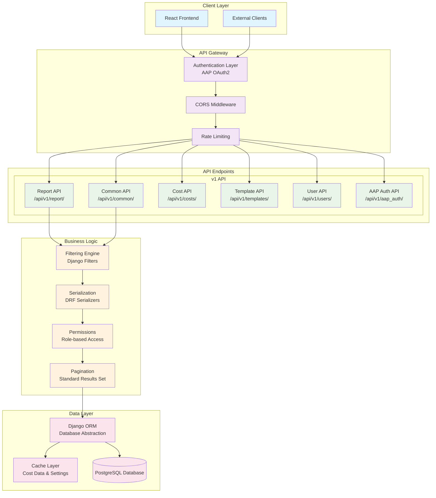
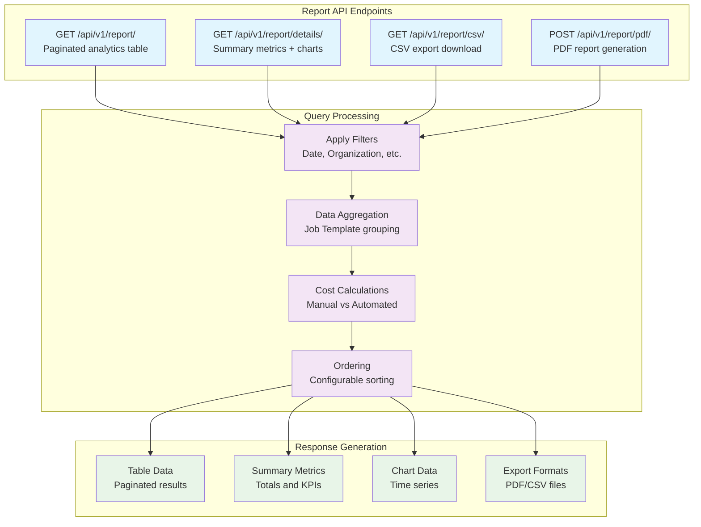

# API Architecture

The Automation Dashboard provides a comprehensive REST API built with Django REST Framework. The API serves as the primary interface between the frontend application and the backend data processing systems.

## API Overview

The API follows REST principles with a clear versioning strategy, comprehensive filtering capabilities, and standardized response formats. All endpoints support JSON serialization and provide consistent error handling.

## API Structure



## Authentication and Authorization

### 1. AAP OAuth2 Integration

**Location**: `src/backend/apps/aap_auth/authentication.py`

The system integrates with AAP's OAuth2 system for secure authentication:

```python
class AAPAuthentication(BaseAuthentication):
    def authenticate(self, request):
        auth_header = request.META.get('HTTP_AUTHORIZATION')
        
        if not auth_header or not auth_header.startswith('Bearer '):
            return None
            
        token = auth_header.split(' ')[1]
        
        # Validate token against AAP
        user_data = self.verify_token_with_aap(token)
        if user_data:
            user = self.get_or_create_user(user_data)
            return (user, token)
            
        return None
```

### 2. Permission System

**Location**: `src/backend/api/v1/permissions.py`

Role-based access control with admin-only endpoints:

```python
class AdminOnlyViewSet:
    """Base class for admin-only API endpoints"""
    permission_classes = [IsAuthenticated, IsAdminUser]
    
    def get_queryset(self):
        # Only admin users can access data
        return super().get_queryset()
```

## Core API Endpoints

### 1. Report API (`/api/v1/report/`)

**Primary Endpoint**: Central analytics and reporting functionality



**Key Features**:
- **Comprehensive Filtering**: 15+ filter parameters
- **Dynamic Aggregation**: Real-time cost and savings calculations
- **Multiple Export Formats**: JSON, CSV, PDF with embedded charts
- **Pagination Support**: Configurable page sizes
- **Sorting**: Multi-field sorting with configurable directions

**Sample Request/Response**:

```bash
GET /api/v1/report/details/?date_range=last_month&organization[]=1&organization[]=2

{
  "total_number_of_successful_jobs": {"value": 1247},
  "total_number_of_failed_jobs": {"value": 23},
  "total_saving": {"value": 45678.90},
  "total_time_saving": {"value": 2340.5},
  "job_chart": {
    "items": [
      {"x": "2025-01-01T00:00:00Z", "y": 45},
      {"x": "2025-01-02T00:00:00Z", "y": 52}
    ],
    "range": "day"
  },
  "host_chart": {
    "items": [
      {"x": "2025-01-01T00:00:00Z", "y": 234},
      {"x": "2025-01-02T00:00:00Z", "y": 267}
    ],
    "range": "day"
  }
}
```

### 2. Common API (`/api/v1/common/`)

**Purpose**: Shared configuration and filter data

**Endpoints**:
- `GET /api/v1/common/settings/` - Application settings
- `POST /api/v1/common/settings/` - Update settings
- `GET /api/v1/common/filter_set/` - Saved filter sets
- `POST /api/v1/common/filter_set/` - Create saved filters
- `PUT /api/v1/common/filter_set/{id}/` - Update saved filters
- `DELETE /api/v1/common/filter_set/{id}/` - Delete saved filters

### 3. Cost API (`/api/v1/costs/`)

**Purpose**: Cost configuration management

```python
# POST /api/v1/costs/
{
  "manual_cost": "50.00",      # Cost per minute for manual execution
  "automated_cost": "20.00"    # Cost per minute for automation platform
}
```

### 4. Template API (`/api/v1/templates/`)

**Purpose**: Job template configuration

```python
# PUT /api/v1/templates/{template_id}/
{
  "time_taken_manually_execute_minutes": 60,    # Manual execution time
  "time_taken_create_automation_minutes": 120   # Time to create automation
}
```

## Filtering System

### 1. Advanced Filter Parameters

The API supports comprehensive filtering across multiple dimensions:

```python
class CustomReportFilter(BaseFilterBackend):
    """Custom filter backend for report endpoints"""
    
    def filter_queryset(self, request, queryset, view):
        # Date range filtering
        if date_range := request.query_params.get('date_range'):
            queryset = self.apply_date_range(queryset, date_range)
            
        # Multi-select filters
        for filter_field in ['organization', 'job_template', 'project', 'label', 'cluster']:
            if values := request.query_params.getlist(f'{filter_field}[]'):
                queryset = getattr(queryset, filter_field)([int(v) for v in values])
                
        return queryset
```

**Available Filters**:

| Parameter | Type | Description |
|-----------|------|-------------|
| `date_range` | String | Predefined ranges (last_month, year_to_date) or custom |
| `start_date` | ISO Date | Custom range start date |
| `end_date` | ISO Date | Custom range end date |
| `organization[]` | Int Array | Organization IDs |
| `job_template[]` | Int Array | Job template IDs |
| `project[]` | Int Array | Project IDs |
| `label[]` | Int Array | Label IDs |
| `cluster[]` | Int Array | Cluster IDs |
| `ordering` | String | Sort field and direction |
| `page` | Int | Page number for pagination |
| `page_size` | Int | Items per page |

### 2. Dynamic Date Ranges

```python
# Predefined ranges
GET /api/v1/report/?date_range=last_month
GET /api/v1/report/?date_range=year_to_date
GET /api/v1/report/?date_range=last_6_month

# Custom ranges  
GET /api/v1/report/?date_range=custom&start_date=2025-01-01&end_date=2025-01-31
```

## Data Serialization

### 1. Job Analytics Serializer

**Location**: `src/backend/api/v1/report/serializers.py`

```python
class JobSerializer(serializers.Serializer):
    name = serializers.CharField()
    job_template_id = serializers.IntegerField()
    runs = serializers.IntegerField()
    successful_runs = serializers.IntegerField()
    failed_runs = serializers.IntegerField()
    num_hosts = serializers.IntegerField()
    elapsed = serializers.DecimalField(max_digits=15, decimal_places=3)
    
    # Cost fields
    manual_costs = serializers.SerializerMethodField()
    automated_costs = serializers.SerializerMethodField()
    savings = serializers.SerializerMethodField()
    
    # Time fields
    manual_time = serializers.SerializerMethodField()
    time_savings = serializers.SerializerMethodField()
    
    def get_manual_costs(self, obj):
        return round(obj['manual_costs'], 2)
        
    def get_automated_costs(self, obj):
        return round(obj['automated_costs'], 2)
        
    def get_savings(self, obj):
        return round(obj['savings'], 2)
```

### 2. Pydantic Schemas

**Location**: `src/backend/apps/clusters/schemas.py`

Type-safe schemas for complex data structures:

```python
class ReportData(BaseModel):
    total_number_of_unique_hosts: ReportDataValue
    total_number_of_successful_jobs: ReportDataValue
    total_number_of_failed_jobs: ReportDataValue
    total_saving: ReportDataValue
    total_time_saving: ReportDataValue
    users: List[UserData]
    projects: List[ProjectData]

class ChartsData(BaseModel):
    job_chart: ChartData
    host_chart: ChartData

class ChartData(BaseModel):
    items: List[ChartItem] = []
    range: str = ""

class ChartItem(BaseModel):
    x: datetime
    y: int
```

## Pagination System

### 1. Standard Pagination

**Configuration**: `django_config/settings.py`

```python
REST_FRAMEWORK = {
    'DEFAULT_PAGINATION_CLASS': 'backend.common.pagination.StandardResultsSetPagination',
    'PAGE_SIZE': 100,
}
```

### 2. Custom Pagination Class

**Location**: `src/backend/common/pagination.py`

```python
class StandardResultsSetPagination(PageNumberPagination):
    page_size = 100
    page_size_query_param = 'page_size'
    max_page_size = 1000
    
    def get_paginated_response(self, data):
        return Response({
            'count': self.page.paginator.count,
            'next': self.get_next_link(),
            'previous': self.get_previous_link(),
            'page_size': self.page_size,
            'results': data
        })
```

## Error Handling

### 1. Standard HTTP Status Codes

| Status | Usage |
|--------|-------|
| 200 | Successful GET/PUT requests |
| 201 | Successful POST (resource created) |
| 400 | Bad request (validation errors) |
| 401 | Unauthorized (authentication required) |
| 403 | Forbidden (insufficient permissions) |
| 404 | Resource not found |
| 500 | Internal server error |

### 2. Error Response Format

```python
# Validation error response
{
  "detail": "Invalid filter parameter",
  "field_errors": {
    "date_range": ["Invalid date range format"]
  }
}

# Authentication error response  
{
  "detail": "Authentication credentials were not provided."
}
```

## API Performance Optimizations

### 1. Database Query Optimization

```python
# Single optimized query vs multiple queries
queryset = (
    Job.objects
    .select_related('cluster', 'organization', 'job_template')
    .prefetch_related('labels')
    .successful_or_failed()
    .values(...)
    .annotate(...)  # All calculations in database
)
```

### 2. Caching Strategy

```python
# Settings and cost data cached
@cache_memoize(timeout=3600)
def get_template_options():
    return {
        'organizations': Organization.objects.all(),
        'projects': Project.objects.all(),
        'job_templates': JobTemplate.objects.all(),
    }
```

### 3. Response Compression

- **Gzip Compression**: Automatic compression for JSON responses
- **Field Selection**: Only required fields included in responses
- **Pagination**: Large datasets split into manageable chunks

## API Security

### 1. CORS Configuration

```python
CORS_ALLOWED_ORIGINS = [
    "http://localhost:9000",
    "http://localhost:8080",
    "http://0.0.0.0:8080",
]
```

### 2. Token Security

- **Encrypted Storage**: OAuth2 tokens encrypted at rest
- **Token Validation**: Real-time validation against AAP
- **Session Management**: Secure session handling

### 3. Rate Limiting

- **Configurable Limits**: API rate limiting per user/IP
- **Export Protection**: Special limits for resource-intensive exports
- **Graceful Degradation**: Appropriate error responses when limits exceeded

## API Testing and Documentation

### 1. API Documentation

- **OpenAPI/Swagger**: Auto-generated API documentation
- **Interactive Testing**: Built-in API testing interface
- **Example Requests**: Comprehensive request/response examples

### 2. Testing Strategy

```python
# API endpoint tests
class ReportAPITestCase(TestCase):
    def test_report_list_endpoint(self):
        response = self.client.get('/api/v1/report/')
        self.assertEqual(response.status_code, 200)
        self.assertIn('results', response.data)
        
    def test_report_filtering(self):
        response = self.client.get('/api/v1/report/?organization[]=1')
        # Test filter application
```

## Next Steps

Continue with:
1. [Frontend Architecture](05-frontend-architecture.md) - How the API integrates with React
2. [Database Schema](06-database-schema.md) - Data models supporting the API