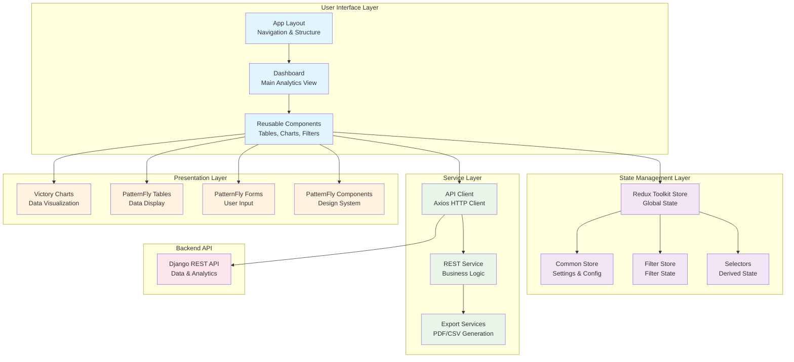
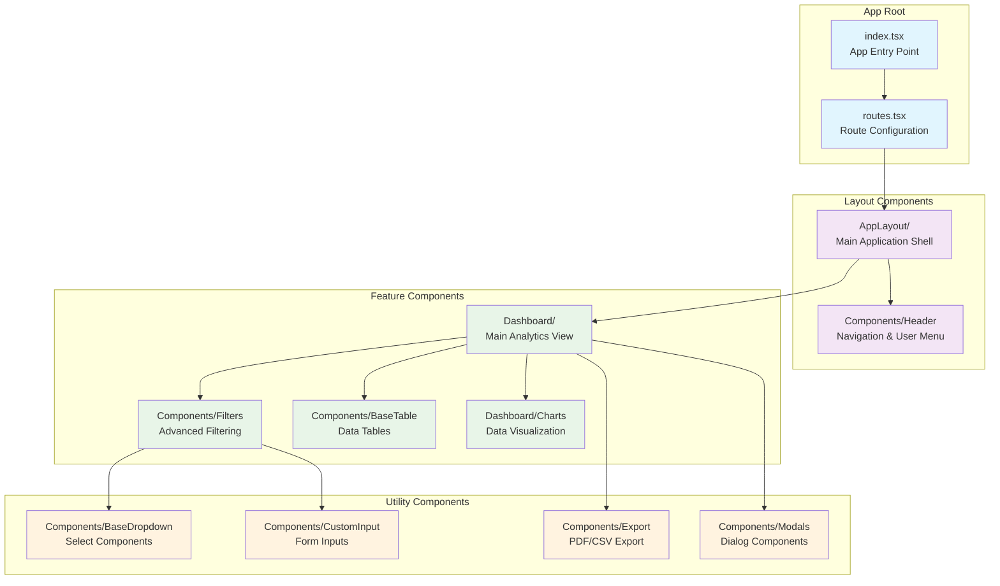
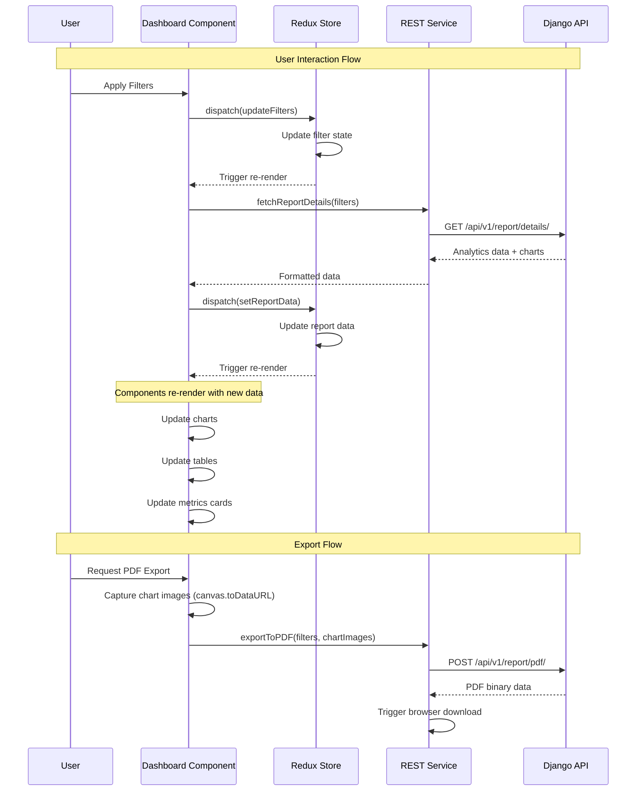

# Frontend Architecture

The Automation Dashboard frontend is a modern React application built with TypeScript and PatternFly components. It provides an interactive interface for exploring automation analytics, generating reports, and managing system configuration.

## Frontend Overview

The frontend follows a component-based architecture with centralized state management, emphasizing reusability, type safety, and consistent user experience through PatternFly design system.

## Architecture Overview



## Component Architecture

### 1. Application Structure

**Location**: `src/frontend/app/`



### 2. Component Hierarchy

**Main Dashboard Component Structure**:

```typescript
// Dashboard/Dashboard.tsx
interface DashboardProps {
  // Props from parent components
}

const Dashboard: React.FC<DashboardProps> = () => {
  return (
    <PageSection>
      <DashboardTotals />           {/* Key metrics cards */}
      <DashboardBarChart />         {/* Job execution trends */}
      <DashboardLineChart />        {/* Host processing trends */}
      <BaseTable />                 {/* Analytics data table */}
      <DashboardTopTable />         {/* Top users/projects */}
    </PageSection>
  );
};
```

## State Management

### 1. Redux Toolkit Architecture

**Location**: `src/frontend/app/Store/`

```typescript
// store.ts - Root store configuration
export const store = configureStore({
  reducer: {
    common: commonSlice.reducer,
    filter: filterSlice.reducer,
  },
  middleware: (getDefaultMiddleware) =>
    getDefaultMiddleware({
      serializableCheck: false,  // For complex date objects
    }),
});

export type RootState = ReturnType<typeof store.getState>;
export type AppDispatch = typeof store.dispatch;
```

### 2. Common State Slice

**Location**: `src/frontend/app/Store/commonStore.ts`

```typescript
interface CommonState {
  reportData: ReportDetail | null;
  templateOptions: TemplateOptions | null;
  loading: boolean;
  error: string | null;
  currency: Currency;
  enableTemplateCreationTime: boolean;
}

const commonSlice = createSlice({
  name: 'common',
  initialState,
  reducers: {
    setReportData: (state, action) => {
      state.reportData = action.payload;
      state.loading = false;
    },
    setLoading: (state, action) => {
      state.loading = action.payload;
    },
    setError: (state, action) => {
      state.error = action.payload;
      state.loading = false;
    }
  }
});
```

### 3. Filter State Management

**Location**: `src/frontend/app/Store/filterStore.ts`

```typescript
interface FilterState {
  dateRange: DateRange;
  selectedOrganizations: number[];
  selectedJobTemplates: number[];
  selectedProjects: number[];
  selectedLabels: number[];
  selectedClusters: number[];
  savedViews: FilterSet[];
  activeView: FilterSet | null;
}

const filterSlice = createSlice({
  name: 'filter',
  initialState,
  reducers: {
    updateDateRange: (state, action) => {
      state.dateRange = action.payload;
    },
    updateOrganizations: (state, action) => {
      state.selectedOrganizations = action.payload;
    },
    saveView: (state, action) => {
      state.savedViews.push(action.payload);
    }
  }
});
```

### 4. Selectors for Derived State

**Location**: `src/frontend/app/Store/commonSelectors.ts`

```typescript
// Memoized selectors for performance
export const selectReportData = (state: RootState) => state.common.reportData;
export const selectIsLoading = (state: RootState) => state.common.loading;

export const selectFilteredData = createSelector(
  [selectReportData, selectActiveFilters],
  (reportData, filters) => {
    if (!reportData) return null;
    
    // Apply client-side filtering if needed
    return reportData;
  }
);

export const selectChartData = createSelector(
  [selectReportData],
  (reportData) => {
    if (!reportData) return null;
    
    return {
      jobChart: reportData.job_chart,
      hostChart: reportData.host_chart
    };
  }
);
```

## Service Layer

### 1. API Client Configuration

**Location**: `src/frontend/app/client/apiClient.ts`

```typescript
import axios from 'axios';

const apiClient = axios.create({
  baseURL: process.env.REACT_APP_API_BASE_URL || '/api/',
  timeout: 30000,
  headers: {
    'Content-Type': 'application/json',
  },
});

// Request interceptor for authentication
apiClient.interceptors.request.use(
  (config) => {
    const token = getAuthToken();
    if (token) {
      config.headers.Authorization = `Bearer ${token}`;
    }
    return config;
  },
  (error) => Promise.reject(error)
);

// Response interceptor for error handling
apiClient.interceptors.response.use(
  (response) => response,
  (error) => {
    if (error.response?.status === 401) {
      // Handle authentication errors
      redirectToLogin();
    }
    return Promise.reject(error);
  }
);
```

### 2. REST Service Layer

**Location**: `src/frontend/app/Services/RestService.ts`

```typescript
const RestService = {
  // Analytics data fetching
  async fetchReports(signal: AbortSignal, params: UrlParams): Promise<TableResponse> {
    const queryString = buildQueryString(params);
    const response = await api.get(`api/v1/report/${queryString}`, { signal });
    return response.data;
  },

  // Summary metrics and charts
  async fetchReportDetails(signal: AbortSignal, params: RequestFilter): Promise<ReportDetail> {
    const queryString = buildQueryString(params);
    const response = await api.get(`api/v1/report/details/${queryString}`, { signal });
    return response.data;
  },

  // Export functionality
  async exportToPDF(params: RequestFilter, jobChart: string, hostChart: string): Promise<void> {
    const queryString = buildQueryString(params);
    const response = await api.post(
      `api/v1/report/pdf/${queryString}`,
      { job_chart: jobChart, host_chart: hostChart },
      { responseType: 'blob' }
    );
    downloadAttachment(response.data, 'report.pdf');
  },

  // Configuration management
  async updateCosts(payload: CostData) {
    return api.post('api/v1/costs/', payload);
  }
};
```

## Data Flow Architecture



## Component Patterns

### 1. Custom Hooks for Data Fetching

```typescript
// Custom hook for report data
const useReportData = (filters: FilterState) => {
  const dispatch = useAppDispatch();
  const { reportData, loading, error } = useAppSelector(selectCommonState);
  
  useEffect(() => {
    const controller = new AbortController();
    
    const fetchData = async () => {
      dispatch(setLoading(true));
      try {
        const data = await RestService.fetchReportDetails(controller.signal, filters);
        dispatch(setReportData(data));
      } catch (error) {
        if (!controller.signal.aborted) {
          dispatch(setError(error.message));
        }
      }
    };
    
    fetchData();
    
    return () => controller.abort();
  }, [filters, dispatch]);
  
  return { reportData, loading, error };
};
```

### 2. Reusable Table Component

```typescript
interface BaseTableProps<T> {
  data: T[];
  columns: TableColumn<T>[];
  loading?: boolean;
  onSort?: (field: keyof T, direction: 'asc' | 'desc') => void;
  onFilter?: (filters: Record<string, any>) => void;
  pagination?: PaginationConfig;
}

const BaseTable = <T extends Record<string, any>>({
  data,
  columns,
  loading = false,
  onSort,
  onFilter,
  pagination
}: BaseTableProps<T>) => {
  return (
    <Table aria-label="Data table">
      <Thead>
        <Tr>
          {columns.map(column => (
            <Th key={column.key} sort={column.sortable ? getSortParams(column.key) : undefined}>
              {column.title}
            </Th>
          ))}
        </Tr>
      </Thead>
      <Tbody>
        {data.map((row, index) => (
          <Tr key={index}>
            {columns.map(column => (
              <Td key={column.key} dataLabel={column.title}>
                {column.render ? column.render(row[column.key], row) : row[column.key]}
              </Td>
            ))}
          </Tr>
        ))}
      </Tbody>
    </Table>
  );
};
```

## Data Visualization

### 1. Victory.js Chart Integration

```typescript
// DashboardBarChart.tsx
const DashboardBarChart: React.FC<ChartProps> = ({ data, loading }) => {
  const theme = useTheme();
  
  if (loading) return <ChartSkeleton />;
  
  return (
    <div className="chart-container">
      <VictoryChart
        theme={PatternFlyChart.theme}
        domainPadding={20}
        padding={{ left: 80, top: 20, right: 40, bottom: 40 }}
        height={300}
      >
        <VictoryAxis dependentAxis tickFormat={(t) => `${t}`} />
        <VictoryAxis />
        <VictoryBar
          data={data.items}
          x="x"
          y="y"
          style={{
            data: { fill: theme.chart.colorScale[0] }
          }}
        />
      </VictoryChart>
    </div>
  );
};
```

### 2. Chart Data Processing

```typescript
const processChartData = (chartData: ChartItem[]): VictoryChartData[] => {
  return chartData.map(item => ({
    x: format(parseISO(item.x), 'MMM dd'),  // Format dates for display
    y: item.y,
    label: `${item.y} jobs`
  }));
};
```

## Form Handling and Validation

### 1. Filter Form Component

```typescript
const Filters: React.FC<FiltersProps> = ({ onFilterChange }) => {
  const [localFilters, setLocalFilters] = useState<FilterState>(initialFilters);
  const { templateOptions } = useAppSelector(selectCommonState);
  
  const handleDateRangeChange = (dateRange: DateRange) => {
    setLocalFilters(prev => ({ ...prev, dateRange }));
    onFilterChange({ ...localFilters, dateRange });
  };
  
  const handleOrganizationChange = (selectedOrganizations: number[]) => {
    setLocalFilters(prev => ({ ...prev, selectedOrganizations }));
    onFilterChange({ ...localFilters, selectedOrganizations });
  };
  
  return (
    <Form>
      <FormGroup label="Date Range" fieldId="date-range">
        <DateRangePicker
          value={localFilters.dateRange}
          onChange={handleDateRangeChange}
          presets={DATE_RANGE_PRESETS}
        />
      </FormGroup>
      
      <FormGroup label="Organizations" fieldId="organizations">
        <MultiChoiceDropdown
          options={templateOptions?.organizations || []}
          selectedValues={localFilters.selectedOrganizations}
          onChange={handleOrganizationChange}
          placeholder="Select organizations..."
        />
      </FormGroup>
    </Form>
  );
};
```

## Performance Optimizations

### 1. Memoization Strategies

```typescript
// Memoize expensive calculations
const MemoizedDashboardTable = memo(DashboardTable, (prevProps, nextProps) => {
  return (
    prevProps.data === nextProps.data &&
    prevProps.loading === nextProps.loading &&
    isEqual(prevProps.filters, nextProps.filters)
  );
});

// Memoize selectors for Redux
const selectExpensiveCalculation = createSelector(
  [selectReportData, selectFilters],
  (reportData, filters) => {
    // Expensive calculation only runs when dependencies change
    return processReportData(reportData, filters);
  }
);
```

### 2. Code Splitting

```typescript
// Route-based code splitting
const Dashboard = lazy(() => import('./Dashboard/Dashboard'));
const Settings = lazy(() => import('./Settings/Settings'));

const AppRoutes: React.FC = () => (
  <Router>
    <Routes>
      <Route 
        path="/dashboard" 
        element={
          <Suspense fallback={<LoadingSpinner />}>
            <Dashboard />
          </Suspense>
        } 
      />
      <Route 
        path="/settings" 
        element={
          <Suspense fallback={<LoadingSpinner />}>
            <Settings />
          </Suspense>
        } 
      />
    </Routes>
  </Router>
);
```

### 3. Virtual Scrolling for Large Datasets

```typescript
// Large table optimization with react-window
const VirtualizedTable: React.FC<VirtualTableProps> = ({ data, columns }) => {
  const Row = ({ index, style }: ListChildComponentProps) => (
    <div style={style}>
      <TableRow data={data[index]} columns={columns} />
    </div>
  );
  
  return (
    <FixedSizeList
      height={400}
      itemCount={data.length}
      itemSize={48}
      overscanCount={10}
    >
      {Row}
    </FixedSizeList>
  );
};
```

## Testing Strategy

### 1. Component Testing

```typescript
// Dashboard.test.tsx
describe('Dashboard Component', () => {
  const mockStore = createMockStore({
    common: {
      reportData: mockReportData,
      loading: false,
      error: null
    },
    filter: mockFilterState
  });
  
  it('renders dashboard components correctly', () => {
    render(
      <Provider store={mockStore}>
        <Dashboard />
      </Provider>
    );
    
    expect(screen.getByTestId('dashboard-totals')).toBeInTheDocument();
    expect(screen.getByTestId('job-chart')).toBeInTheDocument();
    expect(screen.getByTestId('analytics-table')).toBeInTheDocument();
  });
  
  it('handles filter changes correctly', async () => {
    const user = userEvent.setup();
    render(
      <Provider store={mockStore}>
        <Dashboard />
      </Provider>
    );
    
    await user.click(screen.getByLabelText('Organization filter'));
    await user.click(screen.getByText('Engineering'));
    
    // Verify filter state update
    const state = mockStore.getState();
    expect(state.filter.selectedOrganizations).toContain(1);
  });
});
```

### 2. Integration Testing

```typescript
// API integration tests
describe('Report Data Integration', () => {
  it('fetches and displays report data correctly', async () => {
    server.use(
      rest.get('/api/v1/report/details/', (req, res, ctx) => {
        return res(ctx.json(mockReportResponse));
      })
    );
    
    render(<DashboardWithProviders />);
    
    await waitFor(() => {
      expect(screen.getByText('1,247')).toBeInTheDocument(); // Total jobs
      expect(screen.getByText('$45,678.90')).toBeInTheDocument(); // Total savings
    });
  });
});
```

## Build and Development

### 1. Vite Configuration

**Location**: `vite.config.ts`

```typescript
export default defineConfig({
  plugins: [react()],
  resolve: {
    alias: {
      '@app': path.resolve(__dirname, './app'),
      '@components': path.resolve(__dirname, './app/Components'),
      '@services': path.resolve(__dirname, './app/Services'),
    },
  },
  server: {
    port: 9000,
    proxy: {
      '/api': 'http://localhost:8000',  // Proxy API calls to Django
    },
  },
  build: {
    outDir: '../backend/templates/static',
    emptyOutDir: true,
    rollupOptions: {
      output: {
        manualChunks: {
          vendor: ['react', 'react-dom', '@reduxjs/toolkit'],
          charts: ['victory'],
          ui: ['@patternfly/react-core', '@patternfly/react-table'],
        },
      },
    },
  },
});
```

### 2. TypeScript Configuration

**Location**: `tsconfig.json`

```json
{
  "compilerOptions": {
    "target": "ES2020",
    "useDefineForClassFields": true,
    "lib": ["ES2020", "DOM", "DOM.Iterable"],
    "module": "ESNext",
    "skipLibCheck": true,
    "moduleResolution": "bundler",
    "allowImportingTsExtensions": true,
    "resolveJsonModule": true,
    "isolatedModules": true,
    "noEmit": true,
    "jsx": "react-jsx",
    "strict": true,
    "noUnusedLocals": true,
    "noUnusedParameters": true,
    "noFallthroughCasesInSwitch": true,
    "baseUrl": ".",
    "paths": {
      "@app/*": ["./app/*"],
      "@components/*": ["./app/Components/*"],
      "@services/*": ["./app/Services/*"]
    }
  }
}
```

## Deployment Integration

### 1. Static Asset Generation

The frontend builds static assets that are served by Django:

```bash
# Build process
npm run build
# Output: src/backend/templates/static/
```

### 2. Template Integration

**Location**: `src/backend/templates/base.html`

```html
<!DOCTYPE html>
<html>
<head>
    <title>Automation Dashboard</title>
    
    <link href="" rel="stylesheet">
</head>
<body>
    <div id="root"></div>
    <script type="module" src=""></script>
</body>
</html>
```

## Next Steps

Continue with:
1. [Database Schema](06-database-schema.md) - Data models supporting the frontend
2. [Deployment Architecture](07-deployment-architecture.md) - How frontend and backend deploy together