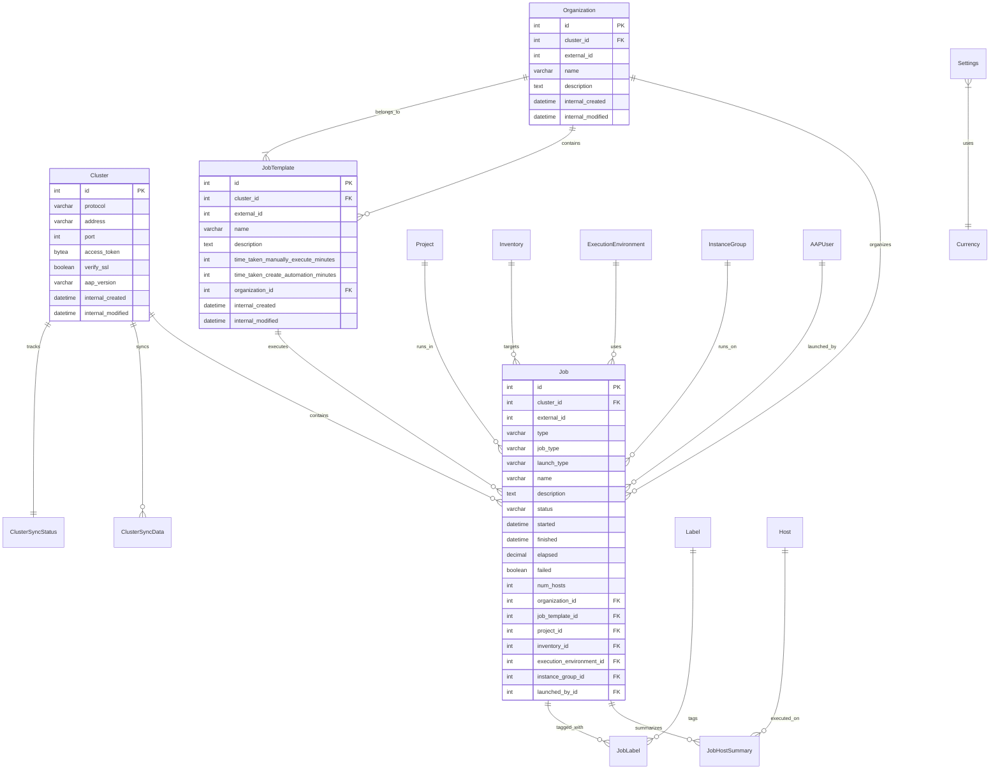

# Database Schema

The Automation Dashboard uses PostgreSQL to store AAP job execution data, configuration settings, and analytics metadata. The schema is designed for efficient analytics queries while maintaining data integrity and supporting incremental data synchronization.

## Schema Overview



## Core Tables

### 1. Cluster Configuration

**Purpose**: Store AAP cluster connection information and OAuth2 credentials

```sql
CREATE TABLE clusters_cluster (
    id SERIAL PRIMARY KEY,
    protocol VARCHAR(10) NOT NULL,           -- 'https'
    address VARCHAR(255) NOT NULL,           -- 'aap.company.com'
    port INTEGER NOT NULL,                   -- 443
    access_token BYTEA NOT NULL,             -- Encrypted OAuth2 token
    verify_ssl BOOLEAN DEFAULT TRUE,         -- SSL verification flag
    aap_version VARCHAR(15) DEFAULT 'AAP 2.4', -- AAP version detection
    internal_created TIMESTAMPTZ DEFAULT NOW(),
    internal_modified TIMESTAMPTZ DEFAULT NOW()
);

-- Unique constraint on cluster endpoint
CREATE UNIQUE INDEX clusters_cluster_endpoint_idx 
ON clusters_cluster(protocol, address, port);
```

**Key Features**:
- **Encrypted Tokens**: OAuth2 access tokens stored as encrypted binary data
- **Version Support**: Handles both AAP 2.4 and 2.5 API differences
- **SSL Configuration**: Per-cluster SSL verification settings

### 2. Job Execution Data

**Purpose**: Store individual job execution records from AAP

```sql
CREATE TABLE clusters_job (
    id SERIAL PRIMARY KEY,
    cluster_id INTEGER REFERENCES clusters_cluster(id) ON DELETE CASCADE,
    external_id INTEGER NOT NULL,           -- AAP job ID
    
    -- Job identification
    type VARCHAR(20) DEFAULT 'job',
    job_type VARCHAR(20) DEFAULT 'run',     -- run/check/scan
    launch_type VARCHAR(20) DEFAULT 'manual', -- manual/scheduled/webhook/etc
    name VARCHAR(255) NOT NULL,
    description TEXT,
    
    -- Execution status
    status VARCHAR(25) DEFAULT 'successful', -- successful/failed/error/canceled
    started TIMESTAMPTZ NOT NULL,
    finished TIMESTAMPTZ,
    elapsed DECIMAL(15,3) DEFAULT 0,        -- Runtime in seconds
    failed BOOLEAN DEFAULT FALSE,
    
    -- Relationships
    organization_id INTEGER REFERENCES clusters_organization(id),
    job_template_id INTEGER REFERENCES clusters_jobtemplate(id),
    project_id INTEGER REFERENCES clusters_project(id),
    inventory_id INTEGER REFERENCES clusters_inventory(id),
    execution_environment_id INTEGER REFERENCES clusters_executionenvironment(id),
    instance_group_id INTEGER REFERENCES clusters_instancegroup(id),
    launched_by_id INTEGER REFERENCES clusters_aapuser(id),
    
    -- Host statistics (aggregated from job_host_summaries)
    num_hosts INTEGER DEFAULT 0,
    changed_hosts_count INTEGER DEFAULT 0,
    dark_hosts_count INTEGER DEFAULT 0,
    failures_hosts_count INTEGER DEFAULT 0,
    ok_hosts_count INTEGER DEFAULT 0,
    processed_hosts_count INTEGER DEFAULT 0,
    skipped_hosts_count INTEGER DEFAULT 0,
    failed_hosts_count INTEGER DEFAULT 0,
    ignored_hosts_count INTEGER DEFAULT 0,
    rescued_hosts_count INTEGER DEFAULT 0,
    
    -- Audit fields
    created TIMESTAMPTZ,                    -- AAP creation time
    modified TIMESTAMPTZ,                   -- AAP modification time
    internal_created TIMESTAMPTZ DEFAULT NOW(),
    internal_modified TIMESTAMPTZ DEFAULT NOW()
);

-- Performance indexes
CREATE INDEX clusters_job_status_finished_idx ON clusters_job(status, finished);
CREATE INDEX clusters_job_cluster_template_idx ON clusters_job(cluster_id, job_template_id);
CREATE INDEX clusters_job_finished_idx ON clusters_job(finished);
CREATE UNIQUE INDEX clusters_job_cluster_external_idx ON clusters_job(cluster_id, external_id);
```

**Key Features**:
- **Composite Keys**: Unique constraint on cluster + external AAP job ID
- **Performance Indexes**: Optimized for common analytics queries
- **Host Aggregation**: Pre-calculated host statistics for performance
- **Relationship Integrity**: Foreign key constraints to related entities

### 3. Job Templates

**Purpose**: Store job template metadata and cost configuration

```sql
CREATE TABLE clusters_jobtemplate (
    id SERIAL PRIMARY KEY,
    cluster_id INTEGER REFERENCES clusters_cluster(id) ON DELETE CASCADE,
    external_id INTEGER NOT NULL,
    name VARCHAR(255) NOT NULL,
    description TEXT,
    
    -- Cost analysis configuration
    time_taken_manually_execute_minutes INTEGER DEFAULT 60,  -- Manual execution time
    time_taken_create_automation_minutes INTEGER DEFAULT 60, -- Automation creation time
    
    -- Organizational relationship
    organization_id INTEGER REFERENCES clusters_organization(id),
    
    internal_created TIMESTAMPTZ DEFAULT NOW(),
    internal_modified TIMESTAMPTZ DEFAULT NOW()
);

CREATE UNIQUE INDEX clusters_jobtemplate_cluster_external_idx 
ON clusters_jobtemplate(cluster_id, external_id);
```

**Cost Analysis Fields**:
- `time_taken_manually_execute_minutes`: Estimated time for manual execution
- `time_taken_create_automation_minutes`: Time investment to create automation
- Used for ROI and savings calculations in analytics

### 4. Host Execution Summaries

**Purpose**: Store per-host execution results for detailed analytics

```sql
CREATE TABLE clusters_jobhostsummary (
    id SERIAL PRIMARY KEY,
    job_id INTEGER REFERENCES clusters_job(id) ON DELETE CASCADE,
    host_id INTEGER REFERENCES clusters_host(id),
    host_name VARCHAR(255),                 -- Fallback if host not in inventory
    
    -- Host execution statistics
    changed INTEGER DEFAULT 0,
    dark INTEGER DEFAULT 0,                 -- Unreachable hosts
    failures INTEGER DEFAULT 0,
    ok INTEGER DEFAULT 0,
    processed INTEGER DEFAULT 0,
    skipped INTEGER DEFAULT 0,
    failed BOOLEAN DEFAULT FALSE,           -- Overall host status
    ignored INTEGER DEFAULT 0,
    rescued INTEGER DEFAULT 0,
    
    -- Timestamps from AAP
    created TIMESTAMPTZ NOT NULL,
    modified TIMESTAMPTZ NOT NULL,
    
    internal_created TIMESTAMPTZ DEFAULT NOW(),
    internal_modified TIMESTAMPTZ DEFAULT NOW()
);

CREATE INDEX clusters_jobhostsummary_job_idx ON clusters_jobhostsummary(job_id);
CREATE INDEX clusters_jobhostsummary_host_idx ON clusters_jobhostsummary(host_id);
```

## Data Synchronization Tables

### 1. Raw Data Storage

**Purpose**: Temporary storage for raw AAP API responses before parsing

```sql
CREATE TABLE clusters_clustersyncdata (
    id SERIAL PRIMARY KEY,
    cluster_id INTEGER REFERENCES clusters_cluster(id) ON DELETE CASCADE,
    data JSONB NOT NULL,                    -- Raw AAP job data
    
    internal_created TIMESTAMPTZ DEFAULT NOW(),
    internal_modified TIMESTAMPTZ DEFAULT NOW()
);

-- Index for JSONB queries
CREATE INDEX clusters_clustersyncdata_data_idx ON clusters_clustersyncdata USING GIN(data);
```

**Usage Pattern**:
1. ApiConnector fetches job data from AAP → stores in `data` field
2. Background parser processes JSON → creates structured records
3. Raw record deleted after successful parsing

### 2. Sync Status Tracking

**Purpose**: Track incremental synchronization progress per cluster

```sql
CREATE TABLE clusters_clustersyncstatus (
    id SERIAL PRIMARY KEY,
    cluster_id INTEGER REFERENCES clusters_cluster(id) ON DELETE CASCADE UNIQUE,
    last_job_finished_date TIMESTAMPTZ NOT NULL,  -- Latest synced job finish time
    
    internal_created TIMESTAMPTZ DEFAULT NOW(),
    internal_modified TIMESTAMPTZ DEFAULT NOW()
);
```

**Incremental Sync Logic**:
```python
# Get last sync timestamp
last_sync = ClusterSyncStatus.objects.get(cluster=cluster)
since = last_sync.last_job_finished_date

# Fetch only newer jobs
jobs_api_url = f"/api/v2/jobs/?finished__gt={since.isoformat()}"
```

## Configuration and Settings Tables

### 1. Cost Configuration

**Purpose**: Store cost rates for ROI calculations

```sql
CREATE TABLE clusters_costs (
    id SERIAL PRIMARY KEY,
    value DECIMAL(15,2) DEFAULT 0,          -- Cost value
    type VARCHAR(20) UNIQUE NOT NULL,       -- 'manual' or 'automated'
    
    internal_created TIMESTAMPTZ DEFAULT NOW(),
    internal_modified TIMESTAMPTZ DEFAULT NOW()
);

-- Default cost values
INSERT INTO clusters_costs (type, value) VALUES 
('manual', 50.00),      -- $50/minute for manual labor
('automated', 20.00);   -- $20/minute for AAP usage
```

### 2. Application Settings

**Purpose**: Store global application configuration

```sql
CREATE TABLE common_settings (
    id SERIAL PRIMARY KEY,
    type VARCHAR(50) UNIQUE NOT NULL,       -- Setting identifier
    value TEXT NOT NULL,                    -- Setting value (JSON serializable)
    
    internal_created TIMESTAMPTZ DEFAULT NOW(),
    internal_modified TIMESTAMPTZ DEFAULT NOW()
);

-- Example settings
INSERT INTO common_settings (type, value) VALUES
('currency', '1'),                          -- Currency ID reference
('enable_template_creation_time', 'true');  -- Include creation time in costs
```

### 3. Currency Support

**Purpose**: Support multiple currencies for cost display

```sql
CREATE TABLE common_currency (
    id SERIAL PRIMARY KEY,
    name VARCHAR(100) NOT NULL,             -- "US Dollar"
    iso_code VARCHAR(3) NOT NULL,           -- "USD"
    symbol VARCHAR(10),                     -- "$"
    
    internal_created TIMESTAMPTZ DEFAULT NOW(),
    internal_modified TIMESTAMPTZ DEFAULT NOW()
);

-- Default currencies
INSERT INTO common_currency (name, iso_code, symbol) VALUES
('US Dollar', 'USD', '$'),
('Euro', 'EUR', '€'),
('British Pound', 'GBP', '£');
```

## Analytics Query Patterns

### 1. Job Analytics Aggregation

**Common Query**: Group jobs by template with cost calculations

```sql
-- Analytics query (simplified - actual query uses Django ORM)
SELECT 
    jt.name,
    jt.id as job_template_id,
    COUNT(j.id) as runs,
    COUNT(CASE WHEN j.status = 'successful' THEN 1 END) as successful_runs,
    COUNT(CASE WHEN j.status = 'failed' THEN 1 END) as failed_runs,
    SUM(j.elapsed) as elapsed,
    SUM(j.num_hosts) as num_hosts,
    
    -- Cost calculations
    SUM(j.num_hosts * jt.time_taken_manually_execute_minutes * 50.00) as manual_costs,
    SUM((jt.time_taken_create_automation_minutes * 50.00) + (j.elapsed * 20.00 / 60)) as automated_costs,
    
    -- Savings
    SUM((j.num_hosts * jt.time_taken_manually_execute_minutes * 50.00) - 
        ((jt.time_taken_create_automation_minutes * 50.00) + (j.elapsed * 20.00 / 60))) as savings

FROM clusters_job j
JOIN clusters_jobtemplate jt ON j.job_template_id = jt.id
WHERE j.status IN ('successful', 'failed')
  AND j.num_hosts > 0
  AND j.finished >= '2025-01-01'
  AND j.finished <= '2025-01-31'
GROUP BY jt.id, jt.name
ORDER BY savings DESC;
```

### 2. Time Series Analytics

**Query Pattern**: Generate time-series data with gap filling

```sql
-- Time series with gap filling using generate_series
WITH date_series AS (
    SELECT generate_series(
        '2025-01-01'::timestamp,
        '2025-01-31'::timestamp,
        '1 day'::interval
    ) AS date_bucket
),
job_counts AS (
    SELECT 
        date_trunc('day', finished) AS date_bucket,
        COUNT(*) AS job_count,
        SUM(num_hosts) AS host_count
    FROM clusters_job
    WHERE finished >= '2025-01-01' 
      AND finished <= '2025-01-31'
      AND status IN ('successful', 'failed')
    GROUP BY date_trunc('day', finished)
)
SELECT 
    ds.date_bucket,
    COALESCE(jc.job_count, 0) AS job_count,
    COALESCE(jc.host_count, 0) AS host_count
FROM date_series ds
LEFT JOIN job_counts jc ON ds.date_bucket = jc.date_bucket
ORDER BY ds.date_bucket;
```

### 3. Unique Host Counting

**Query Pattern**: Count unique hosts across filtered jobs

```sql
-- Unique host count for analytics
SELECT COUNT(DISTINCT jhs.host_id) as unique_hosts
FROM clusters_jobhostsummary jhs
JOIN clusters_job j ON jhs.job_id = j.id
WHERE j.num_hosts > 0
  AND j.status IN ('successful', 'failed')
  AND j.finished >= '2025-01-01'
  AND j.finished <= '2025-01-31'
  AND j.organization_id IN (1, 2, 3);  -- Filter by organizations
```

## Performance Optimization

### 1. Index Strategy

**Primary Indexes**:
- `clusters_job_status_finished_idx`: Core analytics filtering
- `clusters_job_cluster_template_idx`: Template-based grouping
- `clusters_job_finished_idx`: Date range filtering
- Unique indexes prevent duplicate data from sync errors

**JSONB Indexes**:
- `clusters_clustersyncdata_data_idx`: GIN index for JSON queries during parsing

### 2. Query Optimization Techniques

**Aggregation Pushdown**:
```python
# Django ORM - calculations done in database
queryset = Job.objects.values('job_template_id').annotate(
    runs=Count('id'),
    successful_runs=Count('id', filter=Q(status='successful')),
    elapsed=Sum('elapsed'),
    # ... all calculations in single query
)
```

**Selective Field Loading**:
```python
# Only load required fields for analytics
Job.objects.values(
    'name', 'job_template_id', 'elapsed', 'num_hosts', 'status'
).filter(status__in=['successful', 'failed'])
```

### 3. Data Retention Strategy

**Automatic Cleanup**:
```sql
-- Clean up old raw sync data (older than 24 hours)
DELETE FROM clusters_clustersyncdata 
WHERE internal_created < NOW() - INTERVAL '24 hours';

-- Optional: Archive old job data (implementation dependent)
-- Could move jobs older than 2 years to archive tables
```

## Data Integrity and Constraints

### 1. Foreign Key Relationships

All relationships use CASCADE deletion to maintain referential integrity:
- Deleting a Cluster removes all associated Jobs, SyncData, etc.
- Deleting a Job removes all associated JobHostSummary records
- Optional relationships (nullable FKs) handle missing AAP data gracefully

### 2. Business Logic Constraints

```sql
-- Ensure valid job status values
ALTER TABLE clusters_job ADD CONSTRAINT valid_status 
CHECK (status IN ('new', 'pending', 'waiting', 'running', 'successful', 'failed', 'error', 'canceled'));

-- Ensure finished jobs have elapsed time
ALTER TABLE clusters_job ADD CONSTRAINT finished_jobs_have_elapsed
CHECK ((status IN ('successful', 'failed', 'error', 'canceled') AND elapsed IS NOT NULL) OR 
       (status NOT IN ('successful', 'failed', 'error', 'canceled')));
```

### 3. Data Validation

**Model-Level Validation**:
```python
class Job(models.Model):
    def clean(self):
        if self.finished and self.started and self.finished < self.started:
            raise ValidationError("Finished time cannot be before started time")
            
        if self.status in ['successful', 'failed'] and self.num_hosts == 0:
            raise ValidationError("Successful/failed jobs must have host count > 0")
```

## Migration Strategy

### 1. Schema Evolution

The system uses Django migrations for schema changes:
- **Additive Changes**: New columns, indexes, tables
- **Data Migrations**: Transform existing data when schema changes
- **Backward Compatibility**: Maintain API compatibility during upgrades

### 2. Zero-Downtime Deployments

**Safe Migration Patterns**:
1. Add new columns as nullable
2. Deploy application code that writes to both old and new columns
3. Migrate data in background
4. Switch reads to new columns
5. Remove old columns in subsequent release

## Next Steps

Continue with:
1. [Deployment Architecture](07-deployment-architecture.md) - How the database integrates with the deployment
2. [Security Architecture](08-security-architecture.md) - Database security and access control