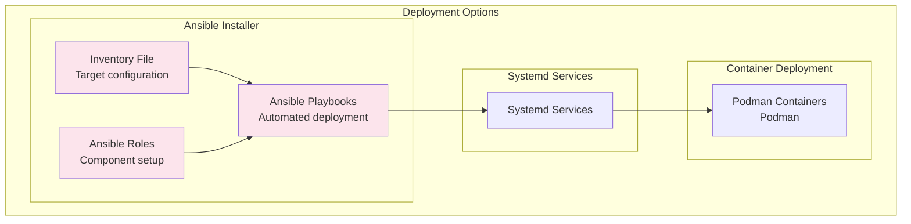
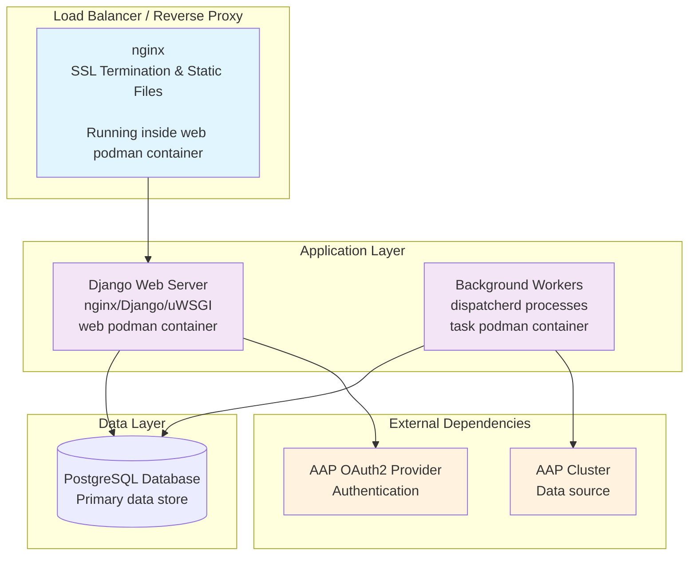

# Deployment Architecture

The Automation Dashboard is designed for containerized deployment using Docker containers orchestrated through Ansible automation. This document details the deployment architecture, infrastructure requirements, and operational considerations.

## Deployment Overview

The system supports both standalone and enterprise deployments, with container-based architecture providing scalability, consistency, and simplified operations.

The system is deployed as set of podman containers.
Each podman container is wrapped into a systemd service.
The deployment is driven by an ansible playbook.
To configure the deployment a single ansible `inventory` file needs to be adjusted.



The application is connected to an AAP instance.
The AAP provides two needed external dependencies:
  - AAP data source.
  - AAP OAuth2 authentication provider.

A running application is exposed over a HTTP.
An nginx reverse web proxy forwards HTTP requests to:
 - backend Django web server or
 - frontend static website

Background workers fetch new data from AAP and writes updated data into PostgreSQL database.
They are running in a dedicated container.



## Container Architecture

### 1. Core Application Containers

**Application Container**: Container image is built using [docker/Dockerfile.backend](../docker/Dockerfile.backend).
The image is used to run both "web" container and "task" container.

**Service Components in Container**:
- **Django Application**: Main web server (uWSGI)
- **Background Workers**: Data sync and processing (dispatcherd)
- **nginx**: Static file serving and reverse proxy
- **Supervisor**: Process management and monitoring

### 2. Database Container

**PostgreSQL Configuration**: The official Red Hat PostgreSQL image is used.
Currently the registry.redhat.io/rhel9/postgresql-15:latest is used.

## Ansible Deployment System

### 1. Deployment Structure

**Location**: `setup/collections/ansible_collections/ansible/containerized_installer/`

```
├── playbooks/
│   ├── reporter_install.yml      # Main installation playbook
│   ├── reporter_uninstall.yml    # Cleanup playbook
│   └── reporter_bundle.yml       # Offline bundle creation
├── roles/
│   ├── automationreporter/       # Main application role
│   ├── postgresql/               # Database setup role
│   └── common/                   # Shared configuration role
└── plugins/
    ├── modules/                  # Custom Ansible modules
    └── lookup/                   # Lookup plugins
```

### 2. Main Installation Playbook

**Playbook location**: `setup/collections/ansible_collections/ansible/containerized_installer/playbooks/reporter_install.yml`

**Main role location**: `setup/collections/ansible_collections/ansible/containerized_installer/roles/automationreporter/tasks/main.yml`

The `reporter_install.yml` will:

- check system is suitable for installation (required packages are present etc.)
- create container images from tarballs included into bundled installer
- setup database container
- setup application containers

While those tasks are executed, also:

- container volumes for persistent data are created
- container secrets are created (database password etc.)
- firewall is configured

## Configuration Management

### 1. File-Based Configuration

Application installation is configured via ansible `inventory` file.
The `invenotyr` is used to create other configuration files,
on container host in `$HOME/aap` directory.
They are mounted as volumes into a container.

Most configuration values have suitable default value.
Main changes to configuration are in following files:

**Settings Structure**:
```
$HOME/aap/reporter/
├── etc
│   ├── conf.d
│   │   └── django_reporter_conf.py
│   ├── launch_reporter_task.sh
│   ├── launch_reporter_web.sh
│   ├── reporter.cert
│   ├── reporter.key
│   └── uwsgi.ini
└── nginx
    └── etc
        └── reporter.conf
```

Most configuration values have suitable default value.
Most important changes to configuration are in following files:

- `$HOME/aap/reporter/etc/conf.d/django_reporter_conf.py`
- `$HOME/aap/reporter/nginx/etc/reporter.conf`

### 2. Secrets Management

The `inventory` file contains secrets (passwords) in plaintext.
If needed, move passwords to separate file and encrypt it using `ansible-vault`.

On running system are secrets stored as podman secrets.

## Deployment Scenarios

### 1. Prerequisites

The AAP will be used as OAuth2 provider for SSO authentication.

First create OAuth2 application at https://AAP_CONTROLLER_FQDN:8443/#/applications:

- Name: automation-dashboard-sso
- Authorization grant type: authorization-code
- Organization: Default
- Redirect URIs: https://AUTOMATION_DASHBOARD_FQDN:8447/auth-callback
- Client type: Confidential

Store the `client_id` and `client_secret`.
The values are input into `inventory` file.

Next create a token at https://AAP_CONTROLLER_FQDN:8443/#/users/<id>/tokens:

- OAuth application: automation-dashboard-sso
- Scope: read

Store access token and refresh token value.
The access token is used in `clusters.yaml`.

### 2. Development Deployment

See top-level [README.md](../README.md)

### 3. Production Deployment

See top-level [setup/README.md](../setup/README.md)

## Next Steps

Continue with:
1. [Security Architecture](08-security-architecture.md) - Detailed security implementation
