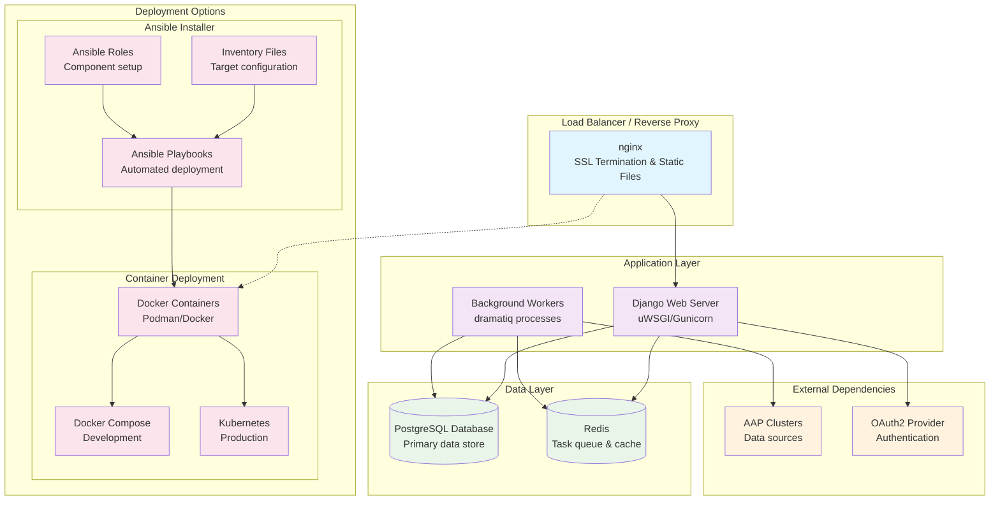
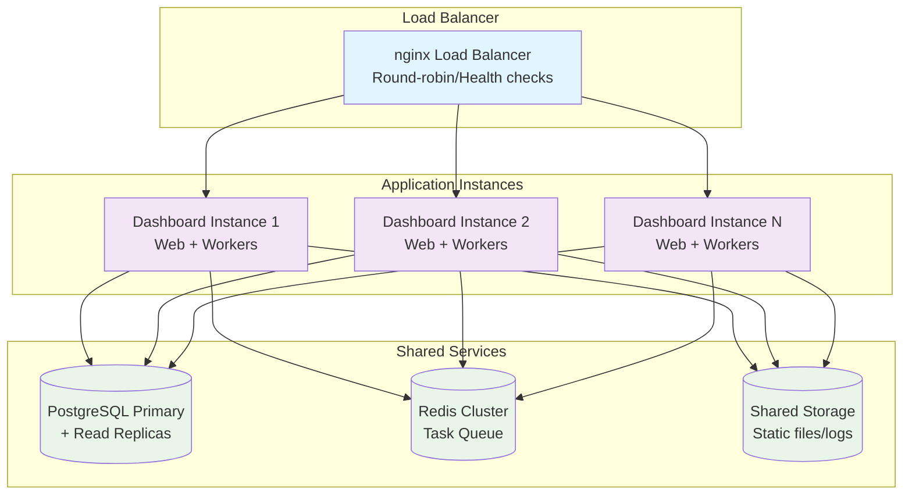

# Deployment Architecture

The Automation Dashboard is designed for containerized deployment using Docker containers orchestrated through Ansible automation. This document details the deployment architecture, infrastructure requirements, and operational considerations.

## Deployment Overview

The system supports both standalone and enterprise deployments, with container-based architecture providing scalability, consistency, and simplified operations.



## Container Architecture

### 1. Core Application Containers

**Backend Application Container**:
```dockerfile
# docker/Dockerfile.backend
FROM python:3.12-slim

# Install system dependencies
RUN apt-get update && apt-get install -y \
    postgresql-client \
    nginx \
    supervisor \
    && rm -rf /var/lib/apt/lists/*

# Install Python dependencies
COPY requirements.txt /tmp/
RUN pip install --no-cache-dir -r /tmp/requirements.txt

# Copy application code
COPY src/backend/ /opt/automation-dashboard/
COPY src/frontend/dist/ /opt/automation-dashboard/static/

# Configuration files
COPY docker/supervisord_reporter_web.conf /etc/supervisor/conf.d/
COPY docker/nginx.conf /etc/nginx/sites-available/default

# Runtime configuration
WORKDIR /opt/automation-dashboard
EXPOSE 8080 8443

CMD ["/usr/bin/supervisord", "-c", "/etc/supervisor/supervisord.conf"]
```

**Service Components in Container**:
- **Django Application**: Main web server (uWSGI)
- **Background Workers**: Data sync and processing (dramatiq)
- **nginx**: Static file serving and reverse proxy
- **Supervisor**: Process management and monitoring

### 2. Database Container

**PostgreSQL Configuration**:
```yaml
# compose/compose.yml - Database service
services:
  db:
    image: postgres:15
    environment:
      POSTGRES_DB: automation_dashboard
      POSTGRES_USER: dashboard_user
      POSTGRES_PASSWORD: secure_password
    volumes:
      - postgres_data:/var/lib/postgresql/data
      - ./init-scripts:/docker-entrypoint-initdb.d/
    ports:
      - "5432:5432"
    healthcheck:
      test: ["CMD-SHELL", "pg_isready -U dashboard_user"]
      interval: 10s
      timeout: 5s
      retries: 5

volumes:
  postgres_data:
    driver: local
```

## Ansible Deployment System

### 1. Deployment Structure

**Location**: `setup/collections/ansible_collections/ansible/containerized_installer/`

```
├── playbooks/
│   ├── reporter_install.yml      # Main installation playbook
│   ├── reporter_uninstall.yml    # Cleanup playbook
│   └── reporter_bundle.yml       # Offline bundle creation
├── roles/
│   ├── automationreporter/       # Main application role
│   ├── postgresql/               # Database setup role
│   └── common/                   # Shared configuration role
└── plugins/
    ├── modules/                  # Custom Ansible modules
    └── lookup/                   # Lookup plugins
```

### 2. Main Installation Playbook

**Location**: `setup/collections/ansible_collections/ansible/containerized_installer/playbooks/reporter_install.yml`

```yaml
---
- name: Install Automation Dashboard
  hosts: dashboard_servers
  become: true
  vars:
    dashboard_image: "automation-dashboard:latest"
    database_password: "{{ vault_database_password }}"
    
  roles:
    - role: common
      tags: ['common', 'setup']
      
    - role: postgresql
      tags: ['database', 'setup']
      when: setup_database | default(true)
      
    - role: automationreporter
      tags: ['application', 'setup']
      
  post_tasks:
    - name: Verify installation
      uri:
        url: "https://{{ ansible_host }}/api/v1/ping/"
        method: GET
        validate_certs: "{{ verify_ssl | default(true) }}"
      register: health_check
      retries: 5
      delay: 10
```

### 3. Application Role Tasks

**Location**: `setup/collections/ansible_collections/ansible/containerized_installer/roles/automationreporter/tasks/main.yml`

```yaml
---
- name: Create application directories
  file:
    path: "{{ item }}"
    state: directory
    owner: "{{ dashboard_user }}"
    group: "{{ dashboard_group }}"
    mode: '0755'
  loop:
    - "{{ dashboard_config_dir }}"
    - "{{ dashboard_data_dir }}"
    - "{{ dashboard_logs_dir }}"

- name: Generate Django configuration
  template:
    src: django_reporter_conf.py.j2
    dest: "{{ dashboard_config_dir }}/settings.py"
    owner: "{{ dashboard_user }}"
    group: "{{ dashboard_group }}"
    mode: '0640'
  notify: restart dashboard

- name: Create database configuration
  template:
    src: postgres.py.j2
    dest: "{{ dashboard_config_dir }}/postgres.py"
    owner: "{{ dashboard_user }}"
    group: "{{ dashboard_group }}"
    mode: '0640'
  notify: restart dashboard

- name: Pull application container
  containers.podman.podman_image:
    name: "{{ dashboard_image }}"
    pull: true
    force: "{{ force_pull | default(false) }}"

- name: Create dashboard container
  containers.podman.podman_container:
    name: automation-dashboard
    image: "{{ dashboard_image }}"
    state: started
    restart_policy: always
    ports:
      - "{{ dashboard_port }}:8080"
      - "{{ dashboard_ssl_port }}:8443"
    volumes:
      - "{{ dashboard_config_dir }}:/etc/dashboard/conf.d:Z"
      - "{{ dashboard_data_dir }}:/var/lib/dashboard:Z"
      - "{{ dashboard_logs_dir }}:/var/log/dashboard:Z"
    env:
      REPORTER_SETTINGS_DIR: "/etc/dashboard/conf.d"
      DATABASE_URL: "{{ database_connection_string }}"
    healthcheck_cmd: "curl -f http://localhost:8080/api/v1/ping/ || exit 1"
    healthcheck_interval: 30s
    healthcheck_timeout: 10s
    healthcheck_retries: 3
```

## Configuration Management

### 1. Environment-Based Configuration

**Settings Structure**:
```
/etc/dashboard/conf.d/
├── settings.py           # Main Django settings
├── postgres.py           # Database configuration
├── secrets.py           # Sensitive data (encrypted)
└── clusters.yaml        # AAP cluster definitions
```

**Dynamic Settings Loading**:
```python
# django_config/settings.py
settings_dir = os.environ.get('REPORTER_SETTINGS_DIR', '/etc/dashboard/conf.d/')
settings_files = os.path.join(settings_dir, '*.py')
if os.path.isdir(settings_dir):
    try:
        include(optional(settings_files), scope=locals())
    except ImportError:
        traceback.print_exc()
        sys.exit(1)
```

### 2. Secrets Management

**Ansible Vault Integration**:
```yaml
# group_vars/dashboard_servers/vault.yml (encrypted)
vault_database_password: "secure_database_password"
vault_oauth_client_secret: "oauth2_client_secret"
vault_secret_key: "django_secret_key"
```

**Template Generation**:
```jinja2
{# templates/secrets.py.j2 #}
# Generated secrets configuration
SECRET_KEY = '{{ vault_secret_key }}'

DATABASES = {
    'default': {
        'ENGINE': 'django.db.backends.postgresql',
        'NAME': '{{ database_name }}',
        'USER': '{{ database_user }}',
        'PASSWORD': '{{ vault_database_password }}',
        'HOST': '{{ database_host }}',
        'PORT': '{{ database_port }}',
    }
}

AAP_AUTH_PROVIDER = {
    'client_secret': '{{ vault_oauth_client_secret }}',
    # ... other OAuth settings
}
```

## Deployment Scenarios

### 1. Development Deployment

**Docker Compose for Development**:
```yaml
# compose/compose.yml
version: '3.8'

services:
  db:
    image: postgres:15
    environment:
      POSTGRES_DB: automation_dashboard
      POSTGRES_USER: dashboard_user
      POSTGRES_PASSWORD: dev_password
    volumes:
      - postgres_data:/var/lib/postgresql/data
    ports:
      - "5432:5432"

  redis:
    image: redis:7-alpine
    ports:
      - "6379:6379"

  backend:
    build:
      context: .
      dockerfile: docker/Dockerfile.backend
    ports:
      - "8080:8080"
    environment:
      - DATABASE_URL=postgresql://dashboard_user:dev_password@db:5432/automation_dashboard
      - REDIS_URL=redis://redis:6379/0
    volumes:
      - ./src/backend:/opt/automation-dashboard
      - ./config:/etc/dashboard/conf.d
    depends_on:
      - db
      - redis

volumes:
  postgres_data:
```

**Development Commands**:
```bash
# Start development environment
cd compose
docker-compose up --build

# Run migrations
docker-compose exec backend python manage.py migrate

# Create superuser
docker-compose exec backend python manage.py createsuperuser

# Sync AAP data
docker-compose exec backend python manage.py syncdata --since=2025-01-01
```

### 2. Production Deployment

**Ansible Inventory Example**:
```ini
# inventory/production
[dashboard_servers]
dashboard-prod-01 ansible_host=10.0.1.10 ansible_user=dashboard
dashboard-prod-02 ansible_host=10.0.1.11 ansible_user=dashboard

[dashboard_servers:vars]
dashboard_port=8080
dashboard_ssl_port=8443
setup_database=true
database_host=db.company.com
verify_ssl=true
force_pull=false

# High availability setup
ha_enabled=true
load_balancer_ip=10.0.1.5
```

**Production Installation**:
```bash
# Install with Ansible
ansible-playbook -i inventory/production \
  playbooks/reporter_install.yml \
  --ask-vault-pass \
  --tags setup

# Verify installation
ansible-playbook -i inventory/production \
  playbooks/reporter_install.yml \
  --tags verify
```

### 3. Kubernetes Deployment

**Kubernetes Manifests**:
```yaml
# k8s/dashboard-deployment.yaml
apiVersion: apps/v1
kind: Deployment
metadata:
  name: automation-dashboard
  namespace: automation-dashboard
spec:
  replicas: 2
  selector:
    matchLabels:
      app: automation-dashboard
  template:
    metadata:
      labels:
        app: automation-dashboard
    spec:
      containers:
      - name: dashboard
        image: automation-dashboard:latest
        ports:
        - containerPort: 8080
        - containerPort: 8443
        env:
        - name: DATABASE_URL
          valueFrom:
            secretKeyRef:
              name: dashboard-secrets
              key: database-url
        - name: REPORTER_SETTINGS_DIR
          value: "/etc/dashboard/conf.d"
        volumeMounts:
        - name: config-volume
          mountPath: /etc/dashboard/conf.d
        - name: data-volume
          mountPath: /var/lib/dashboard
        livenessProbe:
          httpGet:
            path: /api/v1/ping/
            port: 8080
          initialDelaySeconds: 30
          periodSeconds: 10
        readinessProbe:
          httpGet:
            path: /api/v1/ping/
            port: 8080
          initialDelaySeconds: 5
          periodSeconds: 5
      volumes:
      - name: config-volume
        configMap:
          name: dashboard-config
      - name: data-volume
        persistentVolumeClaim:
          claimName: dashboard-data-pvc

---
apiVersion: v1
kind: Service
metadata:
  name: automation-dashboard-service
  namespace: automation-dashboard
spec:
  selector:
    app: automation-dashboard
  ports:
  - name: http
    port: 80
    targetPort: 8080
  - name: https
    port: 443
    targetPort: 8443
  type: LoadBalancer
```

## High Availability and Scaling

### 1. Database High Availability

**PostgreSQL Streaming Replication**:
```yaml
# Ansible configuration for HA database
postgresql_ha_enabled: true
postgresql_replication_slots:
  - name: dashboard_replica_1
    type: physical
postgresql_hot_standby: true
postgresql_wal_level: replica
postgresql_max_wal_senders: 3
```

**Connection Pooling**:
```python
# Database connection pooling configuration
DATABASES = {
    'default': {
        'ENGINE': 'django.db.backends.postgresql',
        'OPTIONS': {
            'MAX_CONNS': 20,
            'OPTIONS': {
                'MAX_CONNECTIONS': 100,
                'application_name': 'automation_dashboard',
            }
        }
    }
}
```

### 2. Application Scaling

**Horizontal Scaling Strategy**:


### 3. Worker Scaling

**Background Worker Configuration**:
```python
# Scale workers based on load
DISPATCHER_WORKER_PROCESSES = {
    'sync_workers': 4,      # AAP data synchronization
    'parse_workers': 2,     # Data parsing and transformation
    'export_workers': 1,    # Report generation
}

# Queue-specific scaling
QUEUE_CONFIGURATIONS = {
    'automation_dashboard_sync_channel': {
        'max_workers': 4,
        'max_tasks_per_worker': 10,
    },
    'automation_dashboard_parse_channel': {
        'max_workers': 2,
        'max_tasks_per_worker': 5,
    }
}
```

## Monitoring and Health Checks

### 1. Application Health Monitoring

**Health Check Endpoints**:
```python
# API health check endpoint
@api_view(['GET'])
def health_check(request):
    return Response({
        'status': 'healthy',
        'timestamp': timezone.now().isoformat(),
        'version': settings.VERSION,
        'database': check_database_connection(),
        'redis': check_redis_connection(),
        'workers': check_worker_status(),
    })
```

**Container Health Checks**:
```dockerfile
# Dockerfile health check
HEALTHCHECK --interval=30s --timeout=10s --start-period=5s --retries=3 \
  CMD curl -f http://localhost:8080/api/v1/ping/ || exit 1
```

### 2. Monitoring Integration

**Prometheus Metrics**:
```python
# Custom metrics for monitoring
from prometheus_client import Counter, Histogram, Gauge

sync_jobs_total = Counter('dashboard_sync_jobs_total', 'Total sync jobs processed')
sync_duration = Histogram('dashboard_sync_duration_seconds', 'Sync job duration')
active_connections = Gauge('dashboard_db_connections', 'Active database connections')
```

**Log Aggregation**:
```yaml
# Logging configuration for centralized collection
LOGGING = {
    'handlers': {
        'json_file': {
            'class': 'pythonjsonlogger.jsonlogger.JsonFormatter',
            'filename': '/var/log/dashboard/app.log',
            'format': '%(asctime)s %(name)s %(levelname)s %(message)s'
        }
    }
}
```

## Backup and Disaster Recovery

### 1. Database Backup Strategy

**Automated Backups**:
```bash
#!/bin/bash
# Automated database backup script
BACKUP_DIR="/var/backups/dashboard"
DATABASE_NAME="automation_dashboard"
DATE=$(date +%Y%m%d_%H%M%S)

# Create backup
pg_dump -h $DB_HOST -U $DB_USER $DATABASE_NAME | \
  gzip > "$BACKUP_DIR/dashboard_backup_$DATE.sql.gz"

# Retain backups for 30 days
find $BACKUP_DIR -name "dashboard_backup_*.sql.gz" -mtime +30 -delete
```

**Ansible Backup Role**:
```yaml
# Backup automation with Ansible
- name: Create database backup
  postgresql_db:
    name: "{{ database_name }}"
    state: dump
    target: "/backup/dashboard_{{ ansible_date_time.epoch }}.sql"
  become_user: postgres
  
- name: Sync backups to remote storage
  synchronize:
    src: "/backup/"
    dest: "{{ backup_remote_location }}"
    delete: yes
```

### 2. Application State Backup

**Configuration Backup**:
```yaml
# Backup critical configuration and secrets
- name: Archive configuration files
  archive:
    path:
      - /etc/dashboard/conf.d/
      - /var/lib/dashboard/clusters.yaml
    dest: "/backup/config_{{ ansible_date_time.epoch }}.tar.gz"
    format: gz
```

## Security Considerations

### 1. Container Security

**Security Hardening**:
```dockerfile
# Run as non-root user
RUN groupadd -r dashboard && useradd -r -g dashboard dashboard
USER dashboard

# Read-only filesystem where possible
VOLUME ["/var/lib/dashboard", "/var/log/dashboard"]

# Minimal base image
FROM python:3.12-slim-bullseye
```

**SELinux/AppArmor Integration**:
```yaml
# Container security policies
- name: Set SELinux context for volumes
  sefcontext:
    target: "{{ dashboard_data_dir }}(/.*)?"
    setype: container_file_t
  when: ansible_selinux.status == "enabled"
```

### 2. Network Security

**TLS Configuration**:
```nginx
# nginx SSL configuration
server {
    listen 8443 ssl http2;
    ssl_certificate /etc/ssl/certs/dashboard.crt;
    ssl_certificate_key /etc/ssl/private/dashboard.key;
    ssl_protocols TLSv1.2 TLSv1.3;
    ssl_ciphers ECDHE-ECDSA-AES128-GCM-SHA256:ECDHE-RSA-AES128-GCM-SHA256;
    ssl_prefer_server_ciphers off;
}
```

## Next Steps

Continue with:
1. [Security Architecture](08-security-architecture.md) - Detailed security implementation