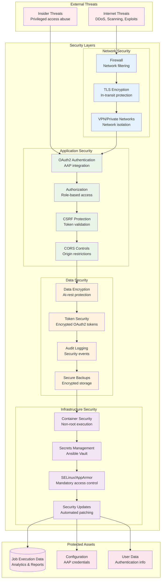
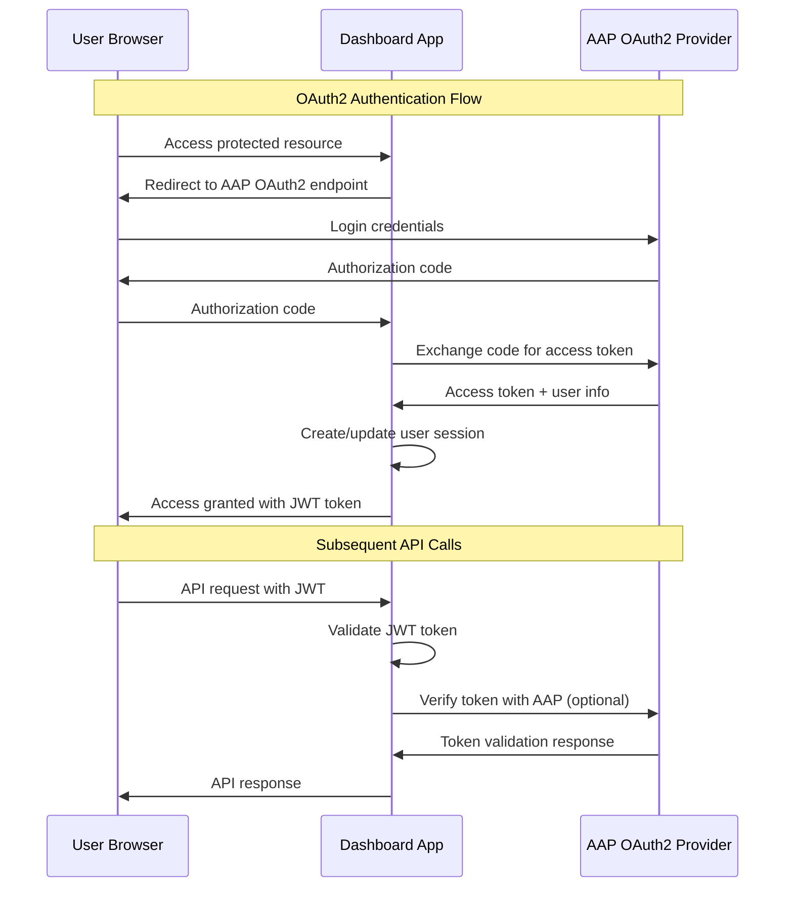

# Security Architecture

The Automation Dashboard implements a comprehensive security architecture based on defense-in-depth principles, OAuth2 integration, and secure containerized deployment. This document details the security controls, authentication mechanisms, and data protection strategies.

## Security Overview

The security architecture addresses multiple threat vectors through layered defenses:



## Authentication and Authorization

### 1. OAuth2 Integration with AAP

**Authentication Flow**:



**OAuth2 Configuration**:

```python
# django_config/settings.py
AAP_AUTH_PROVIDER = {
    'name': 'AAP',
    'protocol': 'https',
    'url': 'https://aap.company.com',
    'user_data_endpoint': 'https://aap.company.com/api/gateway/v1/me/',
    'check_ssl': True,
    'client_id': 'automation_dashboard_client',
    'client_secret': '{{ vault_oauth_client_secret }}',  # Ansible vault encrypted
}

# JWT token configuration
JWT_ACCESS_TOKEN_LIFETIME_SECONDS = 3600        # 1 hour
JWT_REFRESH_TOKEN_LIFETIME_SECONDS = 86400      # 24 hours
```

**Authentication Implementation**:

```python
# backend/apps/aap_auth/authentication.py
class AAPAuthentication(BaseAuthentication):
    """Custom authentication backend for AAP OAuth2 integration"""
    
    def authenticate(self, request):
        auth_header = self.get_auth_header(request)
        if not auth_header:
            return None
            
        token = self.extract_token(auth_header)
        if not token:
            return None
            
        # Validate JWT token locally first
        try:
            payload = jwt.decode(token, settings.SECRET_KEY, algorithms=['HS256'])
        except jwt.InvalidTokenError:
            return None
            
        # Optional: verify with AAP if token is near expiry
        if self.should_verify_with_aap(payload):
            if not self.verify_with_aap(token):
                return None
                
        user = self.get_user_from_payload(payload)
        return (user, token)
    
    def verify_with_aap(self, token):
        """Verify token validity with AAP OAuth2 provider"""
        try:
            response = requests.get(
                f"{settings.AAP_AUTH_PROVIDER['user_data_endpoint']}",
                headers={'Authorization': f'Bearer {token}'},
                verify=settings.AAP_AUTH_PROVIDER['check_ssl'],
                timeout=10
            )
            return response.status_code == 200
        except requests.RequestException:
            return False
```

### 2. Role-Based Access Control (RBAC)

**Permission System**:

```python
# backend/api/v1/permissions.py
class AdminOnlyViewSet:
    """Base viewset requiring admin privileges"""
    permission_classes = [IsAuthenticated, IsAdminUser]
    
    def get_queryset(self):
        # Additional data filtering based on user permissions
        queryset = super().get_queryset()
        
        # Superusers see all data
        if self.request.user.is_superuser:
            return queryset
            
        # Organization admins see only their organization's data
        if hasattr(self.request.user, 'organization_ids'):
            return queryset.filter(
                organization__id__in=self.request.user.organization_ids
            )
            
        # Regular users see no data (admin-only endpoints)
        return queryset.none()

class OrganizationFilteredViewSet(AdminOnlyViewSet):
    """Viewset with organization-based data filtering"""
    
    def filter_by_organization(self, queryset):
        user_orgs = self.get_user_organizations()
        if user_orgs:
            return queryset.filter(organization__in=user_orgs)
        return queryset.none()
```

**User Model Extensions**:

```python
# backend/apps/users/models.py
class User(AbstractUser):
    """Extended user model with AAP integration"""
    
    aap_user_id = models.IntegerField(null=True, blank=True)
    organization_ids = models.JSONField(default=list)    # Authorized organizations
    last_aap_sync = models.DateTimeField(null=True)
    is_aap_admin = models.BooleanField(default=False)
    
    def sync_from_aap(self, aap_user_data):
        """Sync user data from AAP OAuth2 response"""
        self.first_name = aap_user_data.get('first_name', '')
        self.last_name = aap_user_data.get('last_name', '')
        self.email = aap_user_data.get('email', '')
        self.is_aap_admin = aap_user_data.get('is_superuser', False)
        self.organization_ids = aap_user_data.get('organization_ids', [])
        self.last_aap_sync = timezone.now()
        self.save()
```

## Data Protection

### 1. Encryption at Rest

**Database Encryption**:

```yaml
# PostgreSQL encryption configuration
postgresql_ssl: true
postgresql_ssl_cert_file: '/etc/ssl/certs/postgresql.crt'
postgresql_ssl_key_file: '/etc/ssl/private/postgresql.key'
postgresql_ssl_ca_file: '/etc/ssl/certs/ca-certificates.crt'

# Enable transparent data encryption
postgresql_shared_preload_libraries: 'pg_stat_statements,auto_explain,pg_tde'
postgresql_tde_enabled: true
```

**OAuth2 Token Encryption**:

```python
# backend/apps/clusters/encryption.py
from cryptography.fernet import Fernet
from django.conf import settings

class TokenEncryption:
    """Encrypt/decrypt OAuth2 access tokens for storage"""
    
    def __init__(self):
        # Encryption key from settings (generated during installation)
        self.cipher = Fernet(settings.TOKEN_ENCRYPTION_KEY.encode())
    
    def encrypt_token(self, token: str) -> bytes:
        """Encrypt OAuth2 token for database storage"""
        return self.cipher.encrypt(token.encode())
    
    def decrypt_token(self, encrypted_token: bytes) -> str:
        """Decrypt OAuth2 token for API calls"""
        return self.cipher.decrypt(encrypted_token).decode()

def encrypt_value(value: str) -> bytes:
    """Encrypt sensitive configuration values"""
    encryption = TokenEncryption()
    return encryption.encrypt_token(value)

def decrypt_value(encrypted_value: bytes) -> str:
    """Decrypt sensitive configuration values"""
    encryption = TokenEncryption()
    return encryption.decrypt_token(encrypted_value)

# Usage in models
class Cluster(models.Model):
    access_token = models.BinaryField()  # Encrypted OAuth2 token
    
    def set_access_token(self, token: str):
        self.access_token = encrypt_value(token)
    
    def get_access_token(self) -> str:
        return decrypt_value(self.access_token)
```

### 2. Encryption in Transit

**TLS Configuration**:

```nginx
# nginx TLS configuration
server {
    listen 8443 ssl http2;
    server_name dashboard.company.com;

    # TLS certificate configuration
    ssl_certificate /etc/ssl/certs/dashboard.crt;
    ssl_certificate_key /etc/ssl/private/dashboard.key;
    ssl_certificate_chain /etc/ssl/certs/chain.crt;

    # Strong TLS configuration
    ssl_protocols TLSv1.2 TLSv1.3;
    ssl_ciphers ECDHE-ECDSA-AES256-GCM-SHA384:ECDHE-RSA-AES256-GCM-SHA384:ECDHE-ECDSA-CHACHA20-POLY1305;
    ssl_prefer_server_ciphers off;
    ssl_dhparam /etc/ssl/certs/dhparam.pem;

    # HSTS header
    add_header Strict-Transport-Security "max-age=31536000; includeSubDomains" always;
    
    # Security headers
    add_header X-Frame-Options DENY;
    add_header X-Content-Type-Options nosniff;
    add_header X-XSS-Protection "1; mode=block";
    add_header Referrer-Policy "strict-origin-when-cross-origin";
    add_header Content-Security-Policy "default-src 'self'; script-src 'self' 'unsafe-inline'; style-src 'self' 'unsafe-inline';";
}
```

**Database Connection Security**:

```python
# Secure database connections
DATABASES = {
    'default': {
        'ENGINE': 'django.db.backends.postgresql',
        'OPTIONS': {
            'sslmode': 'require',
            'sslcert': '/etc/ssl/certs/client.crt',
            'sslkey': '/etc/ssl/private/client.key',
            'sslrootcert': '/etc/ssl/certs/ca.crt',
        }
    }
}
```

## Application Security Controls

### 1. Input Validation and Sanitization

**Django Security Middleware**:

```python
# django_config/settings.py
MIDDLEWARE = [
    'django.middleware.security.SecurityMiddleware',
    'corsheaders.middleware.CorsMiddleware',
    'django.middleware.csrf.CsrfViewMiddleware',
    'django.contrib.auth.middleware.AuthenticationMiddleware',
    'django.middleware.clickjacking.XFrameOptionsMiddleware',
]

# Security settings
SECURE_SSL_REDIRECT = True
SECURE_HSTS_SECONDS = 31536000
SECURE_HSTS_INCLUDE_SUBDOMAINS = True
SECURE_HSTS_PRELOAD = True
SECURE_CONTENT_TYPE_NOSNIFF = True
SECURE_BROWSER_XSS_FILTER = True
X_FRAME_OPTIONS = 'DENY'

# CSRF protection
CSRF_COOKIE_SECURE = True
CSRF_COOKIE_HTTPONLY = True
CSRF_COOKIE_SAMESITE = 'Strict'

# Session security
SESSION_COOKIE_SECURE = True
SESSION_COOKIE_HTTPONLY = True
SESSION_COOKIE_SAMESITE = 'Strict'
SESSION_COOKIE_AGE = 3600  # 1 hour
```

**API Input Validation**:

```python
# backend/api/v1/report/serializers.py
class ReportFilterSerializer(serializers.Serializer):
    """Validate and sanitize report filter parameters"""
    
    date_range = serializers.ChoiceField(
        choices=DateRangeChoices.choices,
        required=False
    )
    
    start_date = serializers.DateTimeField(required=False)
    end_date = serializers.DateTimeField(required=False)
    
    organization = serializers.ListField(
        child=serializers.IntegerField(min_value=1),
        required=False,
        max_length=100  # Limit array size
    )
    
    def validate(self, attrs):
        """Cross-field validation and security checks"""
        start_date = attrs.get('start_date')
        end_date = attrs.get('end_date')
        
        if start_date and end_date:
            if start_date > end_date:
                raise serializers.ValidationError("Start date must be before end date")
                
            # Prevent excessive date ranges
            max_range = timezone.timedelta(days=365 * 2)  # 2 years max
            if (end_date - start_date) > max_range:
                raise serializers.ValidationError("Date range too large (max 2 years)")
        
        return attrs
```

### 2. SQL Injection Prevention

**Django ORM Protection**:

```python
# Safe parameterized queries using Django ORM
def get_filtered_jobs(request, filters):
    """Safe filtering using Django ORM - prevents SQL injection"""
    
    queryset = Job.objects.all()
    
    # Safe filtering using ORM methods
    if filters.get('organization'):
        queryset = queryset.filter(organization__id__in=filters['organization'])
    
    if filters.get('date_range'):
        date_range = DateRangeChoices.get_date_range(filters['date_range'])
        queryset = queryset.filter(
            finished__gte=date_range.start,
            finished__lte=date_range.end
        )
    
    # Safe aggregation
    return queryset.values('job_template__name').annotate(
        total_runs=Count('id'),
        total_savings=Sum(F('manual_costs') - F('automated_costs'))
    )

# NEVER do this - vulnerable to SQL injection:
# cursor.execute(f"SELECT * FROM jobs WHERE status = '{user_input}'")

# Always use parameterized queries if raw SQL is necessary:
# cursor.execute("SELECT * FROM jobs WHERE status = %s", [user_input])
```

### 3. Cross-Site Request Forgery (CSRF) Protection

**CSRF Token Implementation**:

```python
# API views with CSRF protection
from django.views.decorators.csrf import csrf_protect
from django.middleware.csrf import get_token

@csrf_protect
def sensitive_action(request):
    """Protected endpoint requiring CSRF token"""
    if request.method == 'POST':
        # Process sensitive action
        pass
    
    return JsonResponse({'csrf_token': get_token(request)})
```

**Frontend CSRF Integration**:

```typescript
// Frontend CSRF token handling
const getCsrfToken = (): string => {
  const tokenElement = document.querySelector('meta[name="csrf-token"]');
  return tokenElement ? tokenElement.getAttribute('content') || '' : '';
};

// Include CSRF token in API requests
apiClient.interceptors.request.use((config) => {
  const csrfToken = getCsrfToken();
  if (csrfToken) {
    config.headers['X-CSRFToken'] = csrfToken;
  }
  return config;
});
```

## Infrastructure Security

### 1. Container Security

**Secure Container Configuration**:

```dockerfile
# docker/Dockerfile.backend
FROM python:3.12-slim

# Create non-root user
RUN groupadd -r dashboard \
    && useradd -r -g dashboard -d /opt/dashboard -s /bin/bash dashboard

# Install security updates
RUN apt-get update \
    && apt-get upgrade -y \
    && apt-get install -y --no-install-recommends \
        ca-certificates \
        curl \
    && rm -rf /var/lib/apt/lists/*

# Set up application directory with proper permissions
WORKDIR /opt/dashboard
COPY --chown=dashboard:dashboard src/ /opt/dashboard/

# Switch to non-root user
USER dashboard

# Use read-only filesystem where possible
VOLUME ["/opt/dashboard/data", "/opt/dashboard/logs"]

# Health check
HEALTHCHECK --interval=30s --timeout=10s --start-period=5s --retries=3 \
  CMD curl -f http://localhost:8080/api/v1/ping/ || exit 1

EXPOSE 8080 8443
CMD ["gunicorn", "--bind", "0.0.0.0:8080", "django_config.wsgi:application"]
```

**Container Runtime Security**:

```yaml
# Ansible container security configuration
- name: Run dashboard container with security constraints
  containers.podman.podman_container:
    name: automation-dashboard
    image: "{{ dashboard_image }}"
    state: started
    restart_policy: always
    
    # Security options
    userns_mode: host
    read_only: true
    no_new_privileges: true
    
    # Resource limits
    memory: "2g"
    memory_swap: "2g"
    cpus: "2.0"
    
    # Security capabilities
    cap_drop:
      - ALL
    cap_add:
      - NET_BIND_SERVICE  # Only if binding to privileged ports
    
    # SELinux labels
    security_opts:
      - "label=type:container_runtime_t"
    
    # Mount volumes as read-only where possible
    volumes:
      - "{{ config_dir }}:/etc/dashboard:ro,Z"
      - "{{ data_dir }}:/opt/dashboard/data:rw,Z"
      - "{{ log_dir }}:/opt/dashboard/logs:rw,Z"
```

### 2. Secrets Management

**Ansible Vault Integration**:

```yaml
# Encrypted secrets in Ansible vault
# group_vars/all/vault.yml (encrypted with ansible-vault encrypt)
$ANSIBLE_VAULT;1.1;AES256
66383961663230383762333166323461393834386431633435353264633963306138373734613365
...encrypted content...

# Usage in playbooks
- name: Configure OAuth2 secrets
  template:
    src: oauth_config.py.j2
    dest: /etc/dashboard/conf.d/oauth.py
    mode: '0600'
    owner: dashboard
  vars:
    oauth_client_secret: "{{ vault_oauth_client_secret }}"
```

**Runtime Secrets Management**:

```python
# Secure secrets loading from environment or files
import os
from pathlib import Path

def get_secret(secret_name: str, default: str = None) -> str:
    """Load secrets from environment or secure files"""
    
    # Try environment variable first
    env_value = os.environ.get(secret_name)
    if env_value:
        return env_value
    
    # Try loading from secure file
    secret_file = Path(f"/etc/dashboard/secrets/{secret_name.lower()}")
    if secret_file.exists():
        return secret_file.read_text().strip()
    
    # Use default or raise error
    if default is not None:
        return default
    
    raise ValueError(f"Secret {secret_name} not found")

# Usage in settings
SECRET_KEY = get_secret('DJANGO_SECRET_KEY')
DATABASE_PASSWORD = get_secret('DATABASE_PASSWORD')
OAUTH_CLIENT_SECRET = get_secret('OAUTH_CLIENT_SECRET')
```

## Security Monitoring and Logging

### 1. Security Event Logging

**Comprehensive Audit Logging**:

```python
# backend/apps/common/audit.py
import logging
from django.contrib.auth.signals import user_logged_in, user_logged_out, user_login_failed

security_logger = logging.getLogger('security')

def log_security_event(event_type: str, user=None, request=None, extra_data=None):
    """Log security-relevant events"""
    
    log_data = {
        'event_type': event_type,
        'timestamp': timezone.now().isoformat(),
        'user_id': user.id if user else None,
        'username': user.username if user else None,
        'ip_address': get_client_ip(request) if request else None,
        'user_agent': request.META.get('HTTP_USER_AGENT') if request else None,
        'extra_data': extra_data or {}
    }
    
    security_logger.info('Security event', extra=log_data)

# Signal handlers for authentication events
def user_login_handler(sender, request, user, **kwargs):
    log_security_event('user_login', user=user, request=request)

def user_logout_handler(sender, request, user, **kwargs):
    log_security_event('user_logout', user=user, request=request)

def user_login_failed_handler(sender, credentials, request, **kwargs):
    log_security_event('user_login_failed', request=request, extra_data={
        'attempted_username': credentials.get('username')
    })

user_logged_in.connect(user_login_handler)
user_logged_out.connect(user_logout_handler)
user_login_failed.connect(user_login_failed_handler)
```

**Security Logging Configuration**:

```python
# django_config/settings.py
LOGGING = {
    'version': 1,
    'disable_existing_loggers': False,
    'formatters': {
        'security': {
            'format': '{asctime} {levelname} SECURITY {name} {message}',
            'style': '{',
        },
        'json': {
            '()': 'pythonjsonlogger.jsonlogger.JsonFormatter',
            'format': '%(asctime)s %(name)s %(levelname)s %(message)s %(pathname)s %(lineno)d'
        },
    },
    'handlers': {
        'security_file': {
            'class': 'logging.handlers.RotatingFileHandler',
            'filename': '/var/log/dashboard/security.log',
            'formatter': 'json',
            'maxBytes': 50 * 1024 * 1024,  # 50MB
            'backupCount': 10,
        },
        'syslog': {
            'class': 'logging.handlers.SysLogHandler',
            'address': '/dev/log',
            'facility': 'auth',
            'formatter': 'security',
        },
    },
    'loggers': {
        'security': {
            'handlers': ['security_file', 'syslog'],
            'level': 'INFO',
            'propagate': False,
        },
        'django.security': {
            'handlers': ['security_file'],
            'level': 'INFO',
            'propagate': False,
        }
    }
}
```

### 2. Intrusion Detection

**Rate Limiting and Anomaly Detection**:

```python
# Custom middleware for rate limiting and anomaly detection
from django.core.cache import cache
from django.http import HttpResponseTooManyRequests

class SecurityMiddleware:
    """Security middleware for rate limiting and anomaly detection"""
    
    def __init__(self, get_response):
        self.get_response = get_response
    
    def __call__(self, request):
        # Check for rate limiting
        if self.is_rate_limited(request):
            log_security_event('rate_limit_exceeded', request=request)
            return HttpResponseTooManyRequests("Rate limit exceeded")
        
        # Check for suspicious patterns
        if self.detect_suspicious_activity(request):
            log_security_event('suspicious_activity', request=request, extra_data={
                'path': request.path,
                'method': request.method
            })
        
        response = self.get_response(request)
        return response
    
    def is_rate_limited(self, request) -> bool:
        """Check if request exceeds rate limits"""
        client_ip = get_client_ip(request)
        cache_key = f"rate_limit:{client_ip}"
        
        request_count = cache.get(cache_key, 0)
        if request_count >= 100:  # 100 requests per minute
            return True
        
        cache.set(cache_key, request_count + 1, timeout=60)
        return False
    
    def detect_suspicious_activity(self, request) -> bool:
        """Detect suspicious request patterns"""
        
        # Check for SQL injection attempts
        suspicious_params = ['union', 'select', 'drop', 'insert', '--', ';']
        query_string = request.GET.urlencode().lower()
        if any(param in query_string for param in suspicious_params):
            return True
        
        # Check for excessive parameter counts
        if len(request.GET) > 50:
            return True
        
        # Check for suspicious user agents
        user_agent = request.META.get('HTTP_USER_AGENT', '').lower()
        if any(bot in user_agent for bot in ['sqlmap', 'nikto', 'nmap']):
            return True
        
        return False
```

## Vulnerability Management

### 1. Dependency Scanning

**Automated Vulnerability Scanning**:

```yaml
# .github/workflows/security.yml
name: Security Scan
on:
  push:
    branches: [main]
  pull_request:
    branches: [main]
  schedule:
    - cron: '0 0 * * 0'  # Weekly scan

jobs:
  dependency-scan:
    runs-on: ubuntu-latest
    steps:
      - uses: actions/checkout@v3
      
      - name: Python Security Scan
        uses: pypa/gh-action-pip-audit@v1.0.0
        with:
          inputs: requirements.txt
          
      - name: JavaScript Security Scan
        run: |
          cd src/frontend
          npm audit --audit-level=high
          
      - name: Container Security Scan
        uses: anchore/scan-action@v3
        with:
          image: automation-dashboard:latest
          severity-cutoff: high
```

**Regular Updates**:

```bash
#!/bin/bash
# Automated security update script
set -euo pipefail

# Update base container images
docker pull python:3.12-slim
docker pull postgres:15
docker pull redis:7-alpine

# Update Python dependencies
pip-audit --require-hashes --output json > security-report.json

# Update JavaScript dependencies
cd src/frontend
npm audit fix --only=prod

# Rebuild containers with updated dependencies
docker build -t automation-dashboard:latest -f docker/Dockerfile.backend .
```

### 2. Security Configuration

**Security Hardening Checklist**:

```yaml
# Ansible security hardening playbook
- name: Security Hardening
  hosts: dashboard_servers
  become: true
  tasks:
    
    - name: Disable unused services
      systemd:
        name: "{{ item }}"
        enabled: false
        state: stopped
      loop:
        - telnet
        - ftp
        - rsh
        - rcp
        - rlogin
      ignore_errors: true
    
    - name: Configure firewall
      ufw:
        rule: allow
        port: "{{ item }}"
        proto: tcp
      loop:
        - "22"    # SSH
        - "8443"  # HTTPS dashboard
    
    - name: Set secure SSH configuration
      lineinfile:
        path: /etc/ssh/sshd_config
        regexp: "{{ item.regexp }}"
        line: "{{ item.line }}"
      loop:
        - { regexp: '^PasswordAuthentication', line: 'PasswordAuthentication no' }
        - { regexp: '^PermitRootLogin', line: 'PermitRootLogin no' }
        - { regexp: '^Protocol', line: 'Protocol 2' }
      notify: restart ssh
    
    - name: Configure fail2ban
      copy:
        content: |
          [DEFAULT]
          bantime = 3600
          findtime = 600
          maxretry = 3
          
          [sshd]
          enabled = true
          port = ssh
          filter = sshd
          logpath = /var/log/auth.log
          
          [nginx-req-limit]
          enabled = true
          filter = nginx-req-limit
          action = iptables-multiport[name=ReqLimit, port="http,https", protocol=tcp]
          logpath = /var/log/nginx/error.log
          findtime = 600
          bantime = 7200
          maxretry = 10
        dest: /etc/fail2ban/jail.local
      notify: restart fail2ban
```

## Compliance and Audit

### 1. Security Compliance Framework

**NIST Cybersecurity Framework Mapping**:

| Function | Category | Dashboard Implementation |
|----------|----------|------------------------|
| Identify | Asset Management | Container and dependency inventory |
| Protect | Access Control | OAuth2 + RBAC authentication |
| Protect | Data Security | Encryption at rest and in transit |
| Detect | Security Monitoring | Comprehensive audit logging |
| Detect | Anomaly Detection | Rate limiting and suspicious activity detection |
| Respond | Response Planning | Security incident playbooks |
| Recover | Recovery Planning | Automated backups and disaster recovery |

### 2. Audit Trail

**Compliance Audit Logging**:

```python
# Audit trail for compliance requirements
class AuditLog(models.Model):
    """Detailed audit trail for compliance"""
    
    timestamp = models.DateTimeField(auto_now_add=True)
    user = models.ForeignKey(User, on_delete=models.CASCADE, null=True)
    action = models.CharField(max_length=100)
    resource_type = models.CharField(max_length=50)
    resource_id = models.CharField(max_length=100, null=True)
    ip_address = models.GenericIPAddressField()
    user_agent = models.TextField()
    request_data = models.JSONField(default=dict)
    response_status = models.IntegerField(null=True)
    
    class Meta:
        db_table = 'audit_log'
        indexes = [
            models.Index(fields=['timestamp', 'user']),
            models.Index(fields=['action', 'resource_type']),
        ]

def create_audit_entry(request, action, resource_type=None, resource_id=None, response=None):
    """Create audit log entry for compliance tracking"""
    
    AuditLog.objects.create(
        user=request.user if request.user.is_authenticated else None,
        action=action,
        resource_type=resource_type,
        resource_id=str(resource_id) if resource_id else None,
        ip_address=get_client_ip(request),
        user_agent=request.META.get('HTTP_USER_AGENT', ''),
        request_data={
            'method': request.method,
            'path': request.path,
            'query_params': dict(request.GET),
        },
        response_status=response.status_code if response else None
    )
```

This comprehensive security architecture ensures the Automation Dashboard maintains strong security posture while providing necessary functionality for AAP analytics and reporting. The layered security approach addresses multiple threat vectors and provides defense-in-depth protection for sensitive automation data.