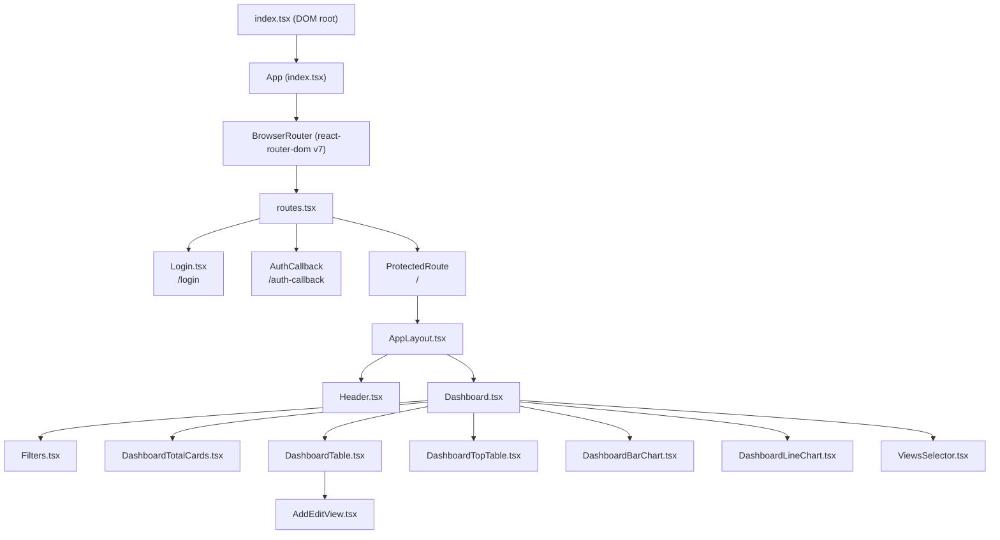
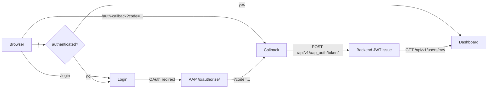
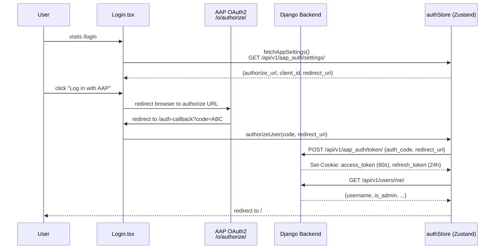
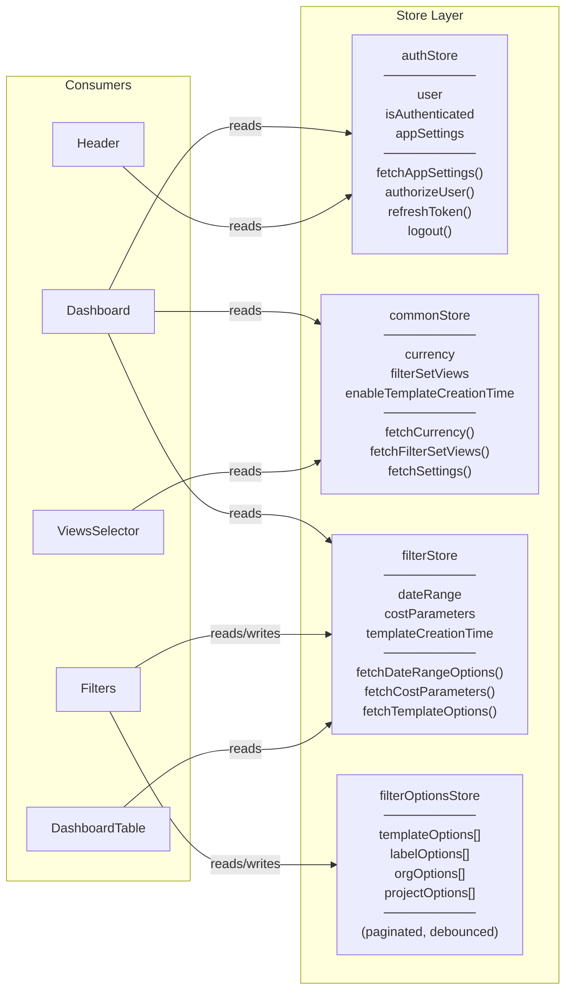
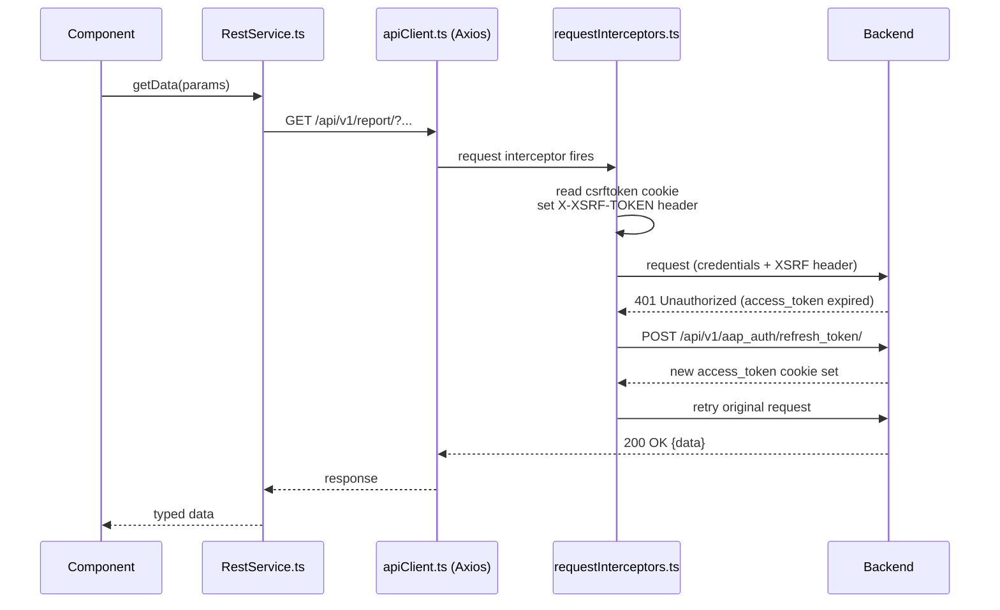
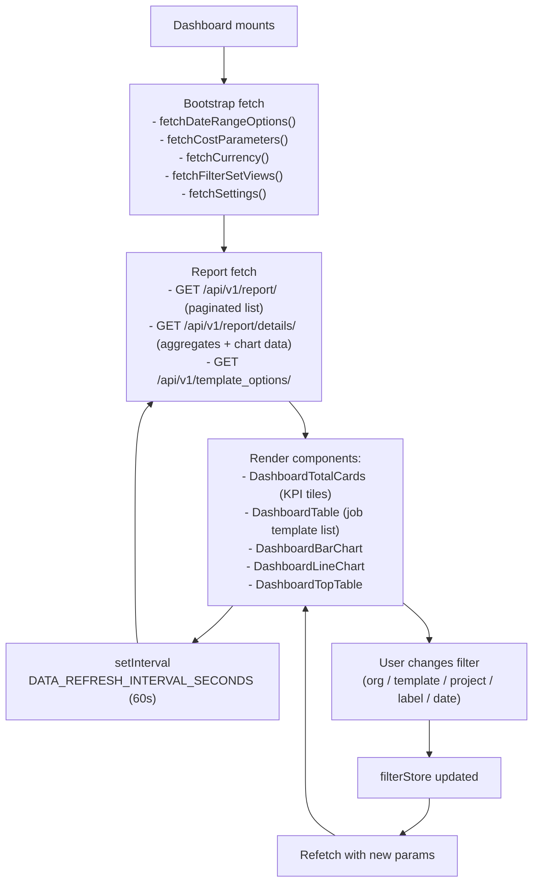
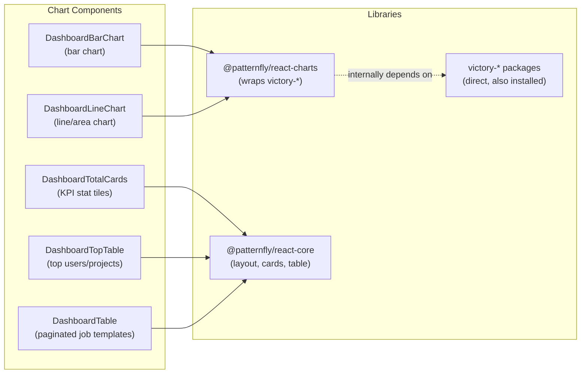
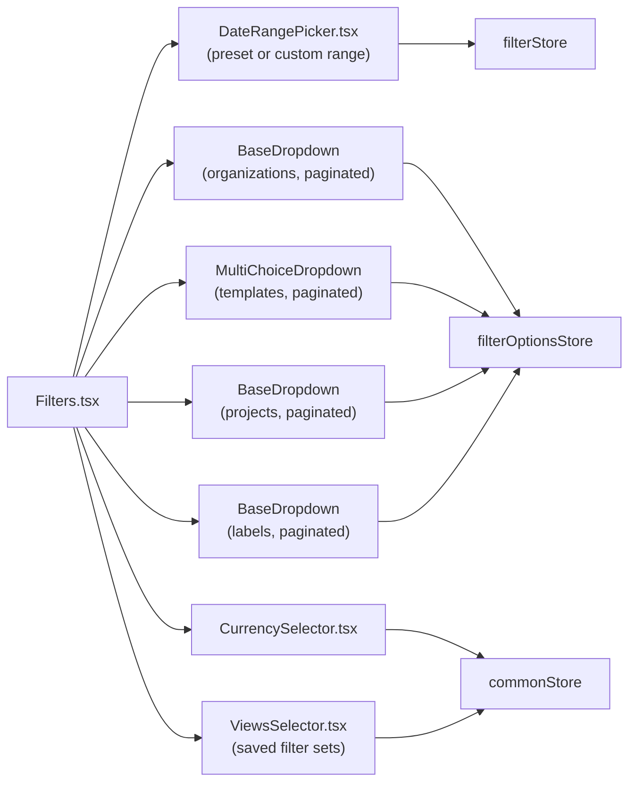
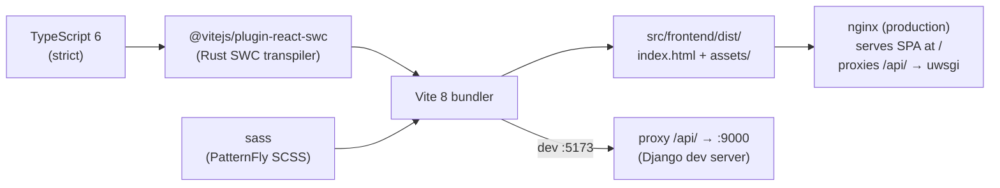
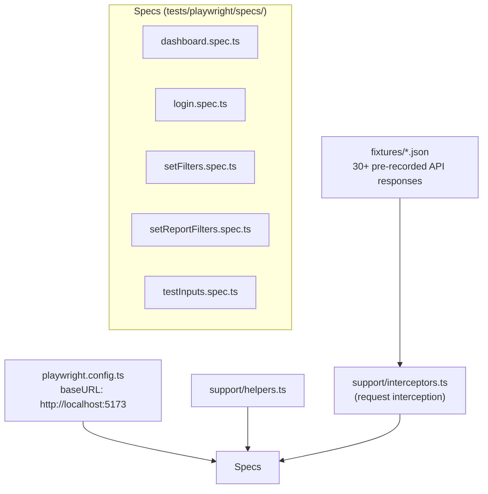

# Frontend Architecture — Detailed

## Overview

The frontend is a single-page application (SPA) built with **React 19**, **TypeScript**, and **Vite 8**. It communicates exclusively with the Django backend via a versioned REST API (`/api/v1/`), uses **Zustand** for client-side state, and delegates authentication to AAP's OAuth2 provider.

---

## Component Hierarchy

---

## Routing

Three routes are registered in `routes.tsx`:

| Path | Component | Guard |
|------|-----------|-------|
| `/login` | `Login` | Redirect to `/` if already authenticated |
| `/auth-callback` | handled inline | None — receives OAuth code |
| `/` | `Dashboard` (inside `AppLayout`) | Redirect to `/login` if not authenticated |

---

## Auth Flow

`Login.tsx` reads the OAuth2 settings (authorize URL, client ID, redirect URI) from the backend via `GET /api/v1/aap_auth/settings/`, then redirects the browser to AAP. On callback, `authorizeUser()` in `authStore` exchanges the code for JWT cookies and hydrates user state.

---

## State Management (Zustand Stores)

Each store is a standalone Zustand slice. Components import selectors directly from their respective store files — there is no shared root store.

| Store | File | Manages |
|-------|------|---------|
| `authStore` | `Store/authStore.ts` | Authentication state, JWT refresh, user profile |
| `commonStore` | `Store/commonStore.ts` | Currency, saved filter sets (`FilterSet`), feature flags |
| `filterStore` | `Store/filterStore.ts` | Active date range, cost parameters, creation time toggle |
| `filterOptionsStore` | `Store/filterOptionsStore.ts` | Paginated dropdown options (templates, labels, orgs, projects) |

---

## API Client and Token Refresh

`apiClient.ts` creates a single Axios instance:
- `baseURL` from `VITE_API_URL` env var
- `withCredentials: true` — sends `HttpOnly` JWT cookies automatically
- XSRF token auto-injected from `csrftoken` cookie into `X-XSRF-TOKEN` header

`requestInterceptors.ts` handles **silent token refresh**: on a 401 it POSTs to `/api/v1/aap_auth/refresh_token/`, the backend issues a new access cookie, and the original request is retried transparently.

All API call definitions live in one file — `Services/RestService.ts`. No component makes a direct Axios call.

---

## Dashboard Data Flow

---

## Chart Layer

`@patternfly/react-charts` already bundles `victory` as a peer dependency. The raw `victory-*` packages in `package.json` are redundant — they add CVE surface with no benefit. See the Recommendations doc.

---

## Filter System

Filter options are fetched lazily and paginatedly from `/api/v1/organizations/`, `/api/v1/labels/`, `/api/v1/projects/`, and `/api/v1/template_options/`. Changes are written into Zustand stores which trigger a dashboard re-fetch.

---

## Build Pipeline

- Alias `@app` → `src/frontend/app/` (configured in both `vite.config.ts` and `tsconfig.json`)
- `rollup-plugin-visualizer` available for bundle size analysis

---

## E2E Test Structure

Tests run against a live dev server with API calls intercepted via pre-recorded JSON fixtures — no real AAP cluster required.

---

## Key File Reference

| File | Path | Role |
|------|------|------|
| DOM entry | `src/frontend/index.tsx` | Root mount |
| App shell | `src/frontend/app/index.tsx` | Router wrapper |
| Routes | `src/frontend/app/routes.tsx` | Route definitions + auth guards |
| Auth store | `src/frontend/app/Store/authStore.ts` | OAuth2 flow, JWT state |
| Common store | `src/frontend/app/Store/commonStore.ts` | Currency, filter sets, settings |
| Filter store | `src/frontend/app/Store/filterStore.ts` | Active filters |
| Filter options | `src/frontend/app/Store/filterOptionsStore.ts` | Paginated dropdown options |
| API client | `src/frontend/app/client/apiClient.ts` | Axios instance |
| Interceptors | `src/frontend/app/client/requestInterceptors.ts` | Token refresh, XSRF |
| All API calls | `src/frontend/app/Services/RestService.ts` | Single HTTP call source |
| Dashboard | `src/frontend/app/Dashboard/Dashboard.tsx` | Main view, polling, filter wiring |
| Layout | `src/frontend/app/AppLayout/AppLayout.tsx` | Navigation shell |
| Types | `src/frontend/app/Types/` | All TypeScript interfaces |
