# Backend Architecture — Detailed

## Overview

The backend is a **Django 5.2** application with **Django REST Framework 3.16**. It ingests automation job data from AAP clusters on a scheduled basis, stores it in PostgreSQL, and exposes aggregated metrics via a REST API. Background work runs through **dispatcherd** (a pg_notify-based task system that replaced Celery). Authentication is delegated to AAP's OAuth2 provider; the backend issues short-lived JWT cookies for session management.

---

## High-Level System Architecture

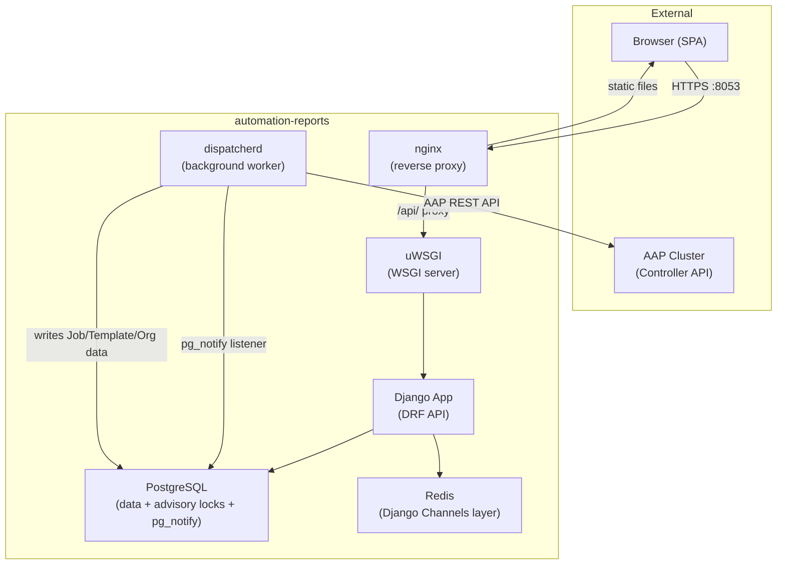

Both the Django API server (uWSGI) and the dispatcher are started by **supervisord** inside the container. The dispatcher runs as a separate OS process: `python manage.py run_dispatcher`.

---

## Django Application Structure

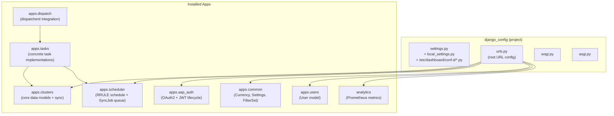

---

## Django Apps — Detailed

### `apps.clusters` — Core Data Layer

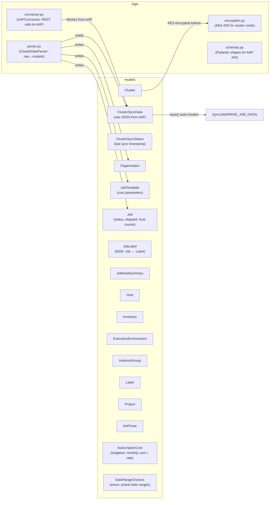

`ClusterSyncData.save()` automatically creates a `SyncJob` of type `PARSE_JOB_DATA` when raw data arrives, ensuring the parse pipeline always runs after a sync.

### `apps.scheduler` — Sync Schedule

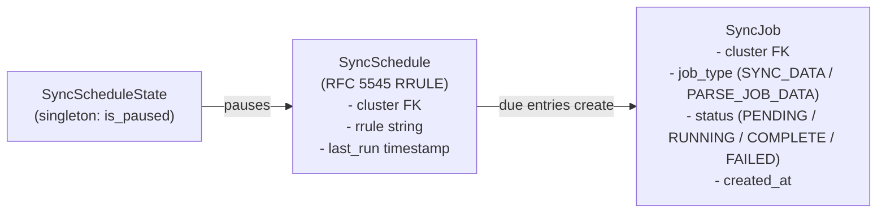

The scheduler fires sync jobs based on RRULE expressions. The periodic task `automation_dashboard_periodic_scheduler` runs every 20 seconds and checks for due schedules using a **PostgreSQL advisory lock** to prevent double-execution across dispatcher instances.

### `apps.dispatch` — Dispatcherd Integration

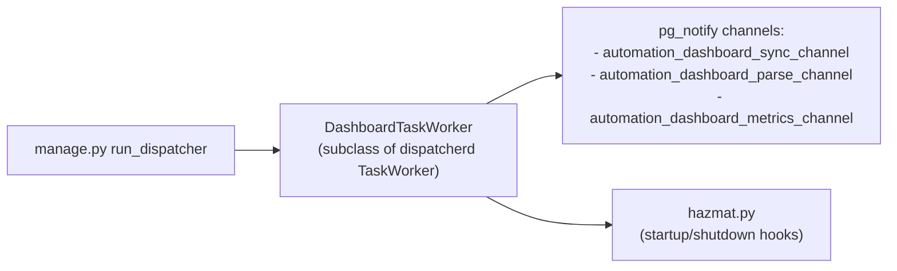

`dispatcherd` replaced Celery. Tasks are triggered by PostgreSQL `pg_notify` messages on named channels. Advisory locks prevent concurrent execution of the same task type.

### `apps.tasks` — Task Implementations

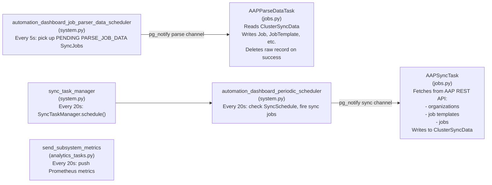

---

## Auth Architecture

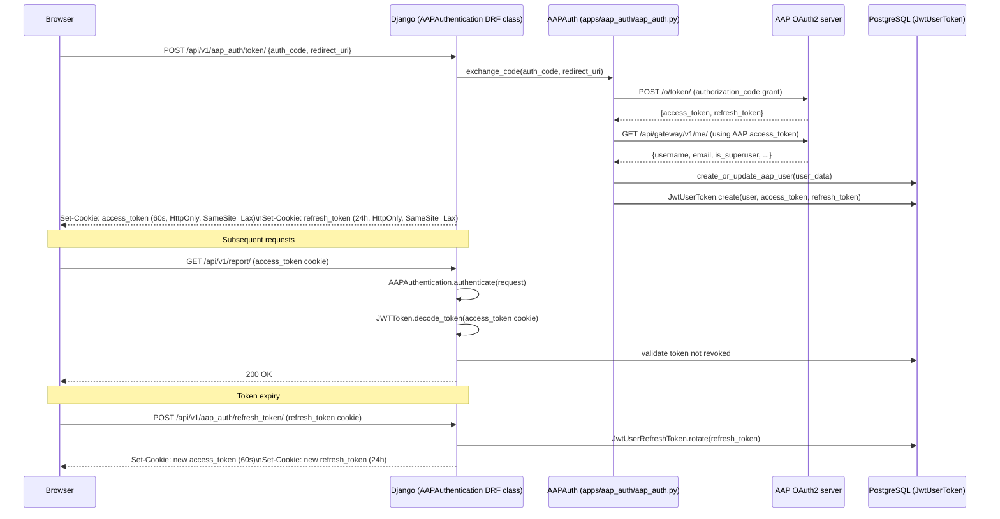

Key implementation details:
- `AAPAuthentication` (DRF `BaseAuthentication` subclass) validates the JWT from the `access_token` cookie on every request
- CSRF enforcement is applied to all state-mutating requests
- `is_platform_auditor` field on `User` grants admin-equivalent API access without Django `is_staff`
- All cluster credentials (tokens for connecting to AAP clusters) are stored AES-256-encrypted in the DB

---

## Data Sync Pipeline

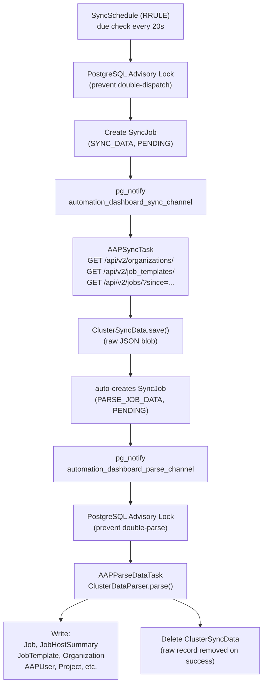

The sync pipeline is designed to be fault-tolerant: raw data (`ClusterSyncData`) is kept until parsing succeeds. If parsing fails, the record remains and can be retried. PostgreSQL advisory locks guarantee that each sync and each parse step runs exactly once even when multiple dispatcher processes are running.

---

## API Layer

### URL Structure

```mermaid
graph TD
    Root["/api/v1/"]
    Root --> ping["ping/ — health check"]
    Root --> template_options["template_options/ — bootstrap data"]
    Root --> report["report/ — main aggregated report"]
    Root --> costs["costs/ — SubscriptionCost update"]
    Root --> templates["templates/ — JobTemplate list + cost params"]
    Root --> common["common/ — Currency, Settings, FilterSet CRUD"]
    Root --> aap_auth["aap_auth/ — OAuth2 + JWT endpoints"]
    Root --> users["users/ — /me/"]
    Root --> labels["labels/ — Label list"]
    Root --> projects["projects/ — Project list"]
    Root --> orgs["organizations/ — Org list"]
    Root --> metrics["metrics/ — Prometheus exposition"]
    Root --> schema["schema/, docs/, redoc/ — OpenAPI"]

    aap_auth --> auth_settings["settings/ — authorize URL, client_id"]
    aap_auth --> auth_token["token/ — exchange OAuth code → JWT cookies"]
    aap_auth --> auth_refresh["refresh_token/ — rotate JWT cookies"]
    aap_auth --> auth_logout["logout/ — clear JWT cookies"]

    report --> report_list["GET list — paginated job template aggregates"]
    report --> report_details["GET details — totals + chart data + top users/projects"]
    report --> report_csv["GET csv — CSV download"]
    report --> report_pdf["POST pdf — WeasyPrint PDF with SVG charts"]
```

### Report View (`api/v1/report/views.py`) — Key Logic

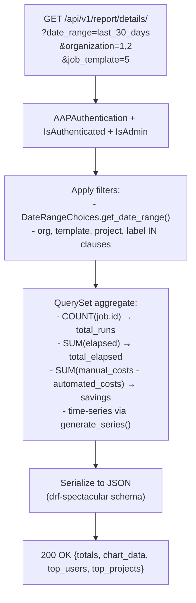

The details endpoint uses `django-generate-series` to produce **gap-free time-series buckets** from PostgreSQL's `generate_series()`. This ensures chart data always has a point for every time bucket in the selected range, even when no jobs ran.

---

## Database Schema (Key Tables)

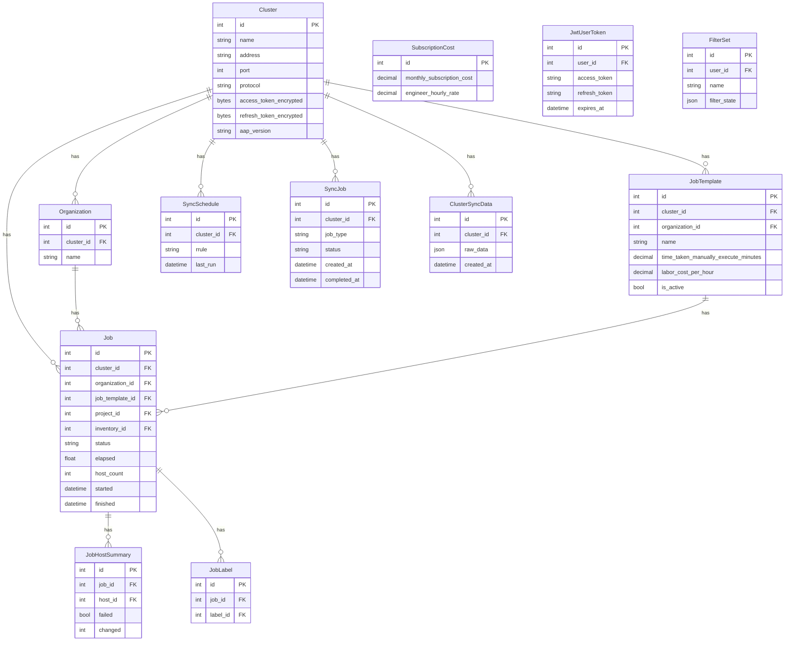

---

## Scheduler Architecture

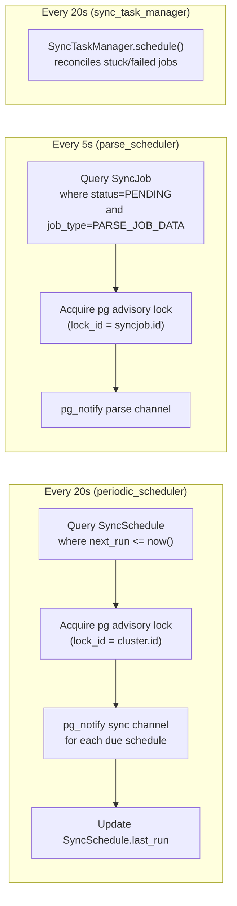

RRULE parsing is handled by `python-dateutil`. Each `SyncSchedule` stores a raw RFC 5545 RRULE string and a `last_run` timestamp; the scheduler computes the next occurrence and fires when it is due.

---

## Analytics and Metrics

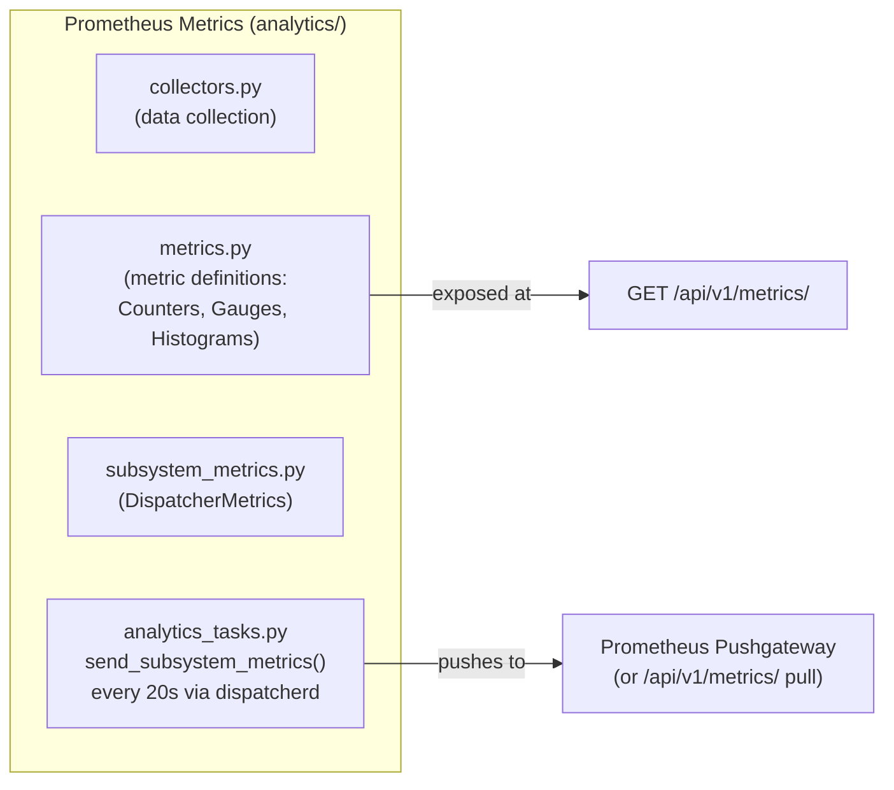

`DispatcherMetrics` tracks task queue depths, execution times, and sync success/failure rates. Metrics are exported both via the pull endpoint (`/api/v1/metrics/`) and pushed to a Pushgateway.

---

## Settings Layering

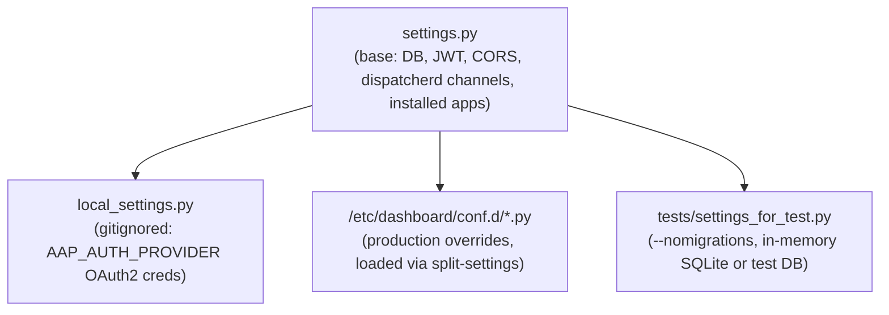

`split-settings` loads all `*.py` files from `DASHBOARD_SETTINGS_DIR` at startup in production, allowing operators to drop override files without modifying the base image.

---

## Container Runtime

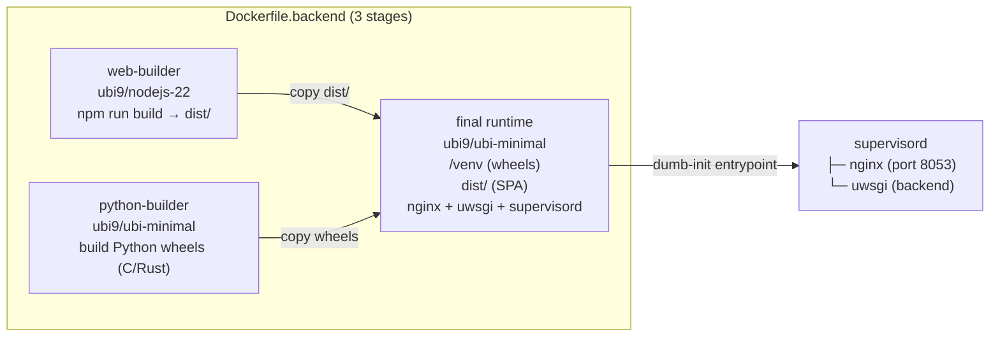

- Port 8053 is exposed — nginx answers HTTP on that port
- `dumb-init` is used as PID 1 to handle signal propagation correctly in containers
- `uwsgi` serves the Django app; nginx reverse-proxies `/api/` to it and serves the SPA for all other paths

---

## Key Source File Reference

| Area | File | Role |
|------|------|------|
| Settings | `src/backend/django_config/settings.py` | Base config |
| Root URLs | `src/backend/django_config/urls.py` | Route registration |
| Core models | `src/backend/apps/clusters/models.py` | All domain models |
| AAP connector | `src/backend/apps/clusters/connector.py` | HTTP calls to AAP |
| Data parser | `src/backend/apps/clusters/parser.py` | Raw JSON → Django models |
| Encryption | `src/backend/apps/clusters/encryption.py` | AES-256 cluster creds |
| OAuth2 client | `src/backend/apps/aap_auth/aap_auth.py` | Code exchange with AAP |
| JWT lifecycle | `src/backend/apps/aap_auth/jwt_token.py` | Token encode/decode/rotate |
| DRF auth class | `src/backend/apps/aap_auth/authentication.py` | Per-request auth |
| Scheduler models | `src/backend/apps/scheduler/models.py` | SyncSchedule, SyncJob |
| Dispatcher | `src/backend/apps/dispatch/dispatcherd.py` | DashboardTaskWorker |
| Sync task | `src/backend/apps/tasks/jobs.py` | AAPSyncTask, AAPParseDataTask |
| Periodic tasks | `src/backend/apps/tasks/system.py` | Scheduler heartbeat tasks |
| Report view | `src/backend/api/v1/report/views.py` | Main aggregation endpoint |
| API URLs | `src/backend/api/v1/urls.py` | Full API route map |
| Prometheus | `src/backend/analytics/metrics.py` | Metric definitions |
